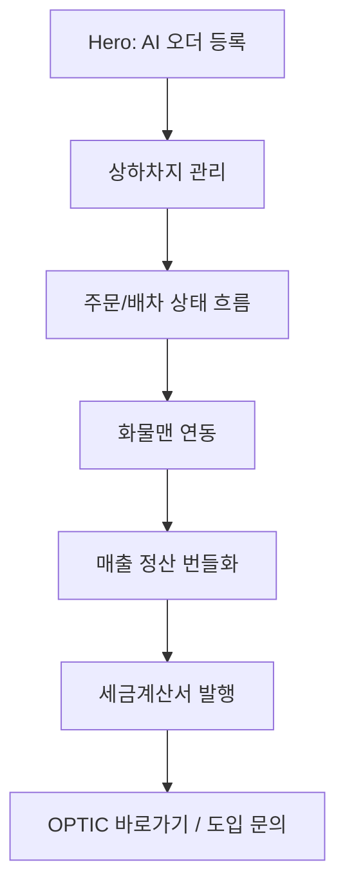

# 03. 애니메이션과 섹션 매뉴얼

## 1. 전체 흐름

현재 hero는 유지한다. hero 이후에는 “AI가 운송 오더 정보를 등록한 뒤, 그 데이터가 실제 운영 업무로 이어진다”는 흐름을 보여준다.

## 2. 기능별 애니메이션 아이디어

| 기능 | 보여줄 업무 문제 | 애니메이션 표현 | 사용자가 이해해야 할 메시지 |
| --- | --- | --- | --- |
| AI 오더 등록 | 주문 정보를 매번 손으로 입력해야 함 | 현재 hero 애니메이션 유지. 텍스트가 필드로 추출되고 Order 카드가 생성됨 | “복잡한 운송 오더 정보가 자동으로 입력된다” |
| 상하차지 관리 | 반복 거래처의 주소, 담당자, 연락처를 매번 다시 입력함 | 상차지/하차지 카드가 주소록에서 자동완성되고 지도 핀이 찍힘 | “자주 쓰는 장소는 재입력하지 않는다” |
| 주문/배차 상태 | 현재 운송 단계가 흩어져 보이면 추적이 어렵다 | 운송요청 → 배차대기 → 배차완료 → 상차대기 → 상차완료 → 운송중 → 하차완료 → 운송완료 상태 바 | “운송이 어디까지 왔는지 한눈에 보인다” |
| 화물맨 연동 | 외부 플랫폼에 같은 내용을 다시 입력해야 함 | OPTIC 주문 카드에서 화물맨 전송 배지가 켜지고, 전송 성공/오류 로그가 쌓임 | “한 번 입력한 정보가 화물맨으로 이어진다” |
| 매출 정산 번들화 | 운송 건별로 청구하면 누락과 반복 업무가 생김 | 여러 완료 주문 카드가 SalesBundle 한 장으로 모이고 총액/부가세가 계산됨 | “여러 운송 건을 한 번에 청구한다” |
| 매입 정산 번들화 | 기사/운송사 지급을 건별로 관리해야 함 | 기사별 완료 주문이 PurchaseBundle로 묶이고 송금 상태가 표시됨 | “지급 업무도 묶어서 관리한다” |
| 세금계산서 발행 | 정산 이후 증빙 상태를 따로 확인해야 함 | SalesBundle에서 계산서 문서가 생성되고 발행/전송/입금 상태가 이어짐 | “정산과 증빙이 끊기지 않는다” |

## 3. 섹션 구조 제안

| 우선순위 | 섹션 | 목적 | 추천 제목 | 보여줄 UI/애니메이션 | 근거 |
| ---: | --- | --- | --- | --- | --- |
| 1 | Hero | 현재 강점 유지 | 오더부터 정산까지, 운송 운영을 한눈에 | 기존 AI 오더 등록 preview 유지 | 현재 landing hero |
| 2 | 업무 흐름 overview | 방문자에게 전체 흐름을 먼저 이해시킴 | AI가 등록한 오더가 운영 흐름으로 이어집니다 | 5단계 horizontal timeline | `order-flow-guide.md`, `charge-domain-guide.md` |
| 3 | 상하차지 관리 | 반복 입력 감소 설명 | 반복되는 상하차지는 주소록처럼 관리하세요 | 지도 핀, 주소 카드, 담당자 자동 채움 | `address-domain-snapshot-strategy.md`, broker/shipper manual |
| 4 | 배차/운송 상태 | 운영 모니터링 가치 설명 | 배차부터 하차완료까지 상태가 이어집니다 | 상태 pill이 순차 이동하는 운송 카드 | `order-flow-guide.md` |
| 5 | 외부 연동 | 화물맨 가치 설명 | 한 번 등록한 운송 정보를 화물맨으로 연결합니다 | 전송 버튼, 성공/오류 로그, sync badge | current integration data, broker manual external error note |
| 6 | 정산 번들 | 정산 자동화의 구체성 강화 | 완료된 운송 건을 묶어 매출 정산으로 전환합니다 | 여러 주문 카드가 SalesBundle로 접힘 | `settlement-process-guide.md`, feature index |
| 7 | 세금계산서 | 후속 회계 업무 연결 | 정산 묶음에서 세금계산서 상태까지 확인합니다 | 계산서 문서 생성, 발행/입금 상태 흐름 | `charge-domain-guide.md`, `settlement-process-guide.md` |
| 8 | 역할별 가치 | Broker/Shipper 제품 섹션 보강 | 주선사와 화주가 같은 흐름을 다르게 봅니다 | Broker/Shipper 탭 전환 | broker/shipper manual |
| 9 | CTA | 실제 서비스와 문의 분리 | 실제 서비스에서 확인하고, 도입은 문의로 이어가세요 | `OPTIC 바로가기` + `도입 문의하기` CTA | final prompt update |

## 4. 스크롤 연출 원칙

| 원칙 | 설명 |
| --- | --- |
| hero는 건드리지 않는다 | 첫 화면의 AI 오더 등록 애니메이션은 현재 브랜드 경험의 중심이다 |
| 한 섹션에 한 업무만 보여준다 | 상하차지, 연동, 정산, 계산서를 한 화면에 다 넣으면 이해가 흐려진다 |
| 데이터가 이어지는 느낌을 준다 | hero에서 생성된 Order 카드가 아래 섹션에서 계속 변환되는 구조가 좋다 |
| 애니메이션은 설명을 대신하지 않는다 | 제목과 짧은 본문으로 “왜 중요한지”를 먼저 말하고, 애니메이션은 증거처럼 보여준다 |
| mobile은 축약한다 | 모바일에서는 긴 파이프라인보다 카드형 stepper가 안정적이다 |

## 5. MVP 구현 범위

| 포함 | 보류 |
| --- | --- |
| hero 유지 | hero 리디자인 |
| 상하차지 관리 섹션 | 실제 지도 API 연동 |
| 화물맨 전송 상태 mock | 실제 외부 API 호출 |
| 매출 정산 번들 애니메이션 | 매입 정산까지 완전한 상세 플로우 |
| 세금계산서 상태 mock | 실제 전자세금계산서 API 연동 |
| 헤더 실제 서비스 이동 CTA | 로그인/권한 분기 |

## 6. OPTICS 엔진 관점 보조 매핑

이 매핑은 고객용 랜딩 전면에 노출하지 않는다. 구현 문서나 내부 설명에서만 사용한다.

| 랜딩 장면 | 내부 엔진 관점 |
| --- | --- |
| AI 오더 등록 | `OPTICS Core`, `OPTICS Signal` |
| 배차/운송 상태 | `OPTICS Match`, `OPTICS Route`, `OPTICS Signal` |
| 정산 번들 | `OPTICS Ledger` |
| 세금계산서 상태 | `OPTICS Ledger` |
