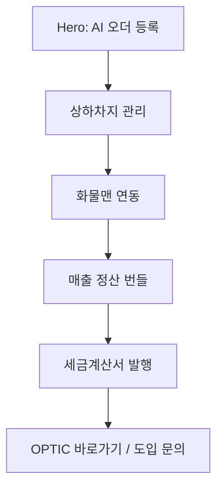

# 07. 구현 로드맵

## 1. 목표

이 문서는 최종 프롬프트 패키지를 실제 랜딩 코드에 반영하기 위한 구현 순서표다.
목표는 **현재 hero의 AI 오더 등록 경험은 유지**하면서, 아래 흐름을 랜딩 전체에 반영하는 것이다.

1. OPTIC/OPTICS 브랜드 v1.0 적용
2. 제공 로고 기반 헤더/footer 브랜드 정리
3. `OPTIC 바로가기` 실제 서비스 CTA 추가
4. 화물맨 연동, 상하차지 관리, 매출 정산 번들화, 세금계산서 발행을 매뉴얼형 스크롤 섹션으로 구성
5. `화물맨`을 제외한 외부 브랜드명 노출 최소화

## 2. 구현 기준 경로

| 항목 | 기준 |
| --- | --- |
| 작업 루트 | `C:/Program Files (user)/mologado/apps/landing` |
| 실제 앱 코드 | `src/app`, `src/components`, `src/lib` |
| 현재 페이지 구성 | `src/app/page.tsx` |
| 주요 섹션 | `src/components/sections/*.tsx` |
| hero/AI 오더 등록 미리보기 | `src/components/sections/hero.tsx`, `src/components/dashboard-preview/**` |
| 상수/카피 데이터 | `src/lib/constants.ts` |
| 로고 컴포넌트 | `src/components/icons/optic-logo.tsx` |

주의: IDE에서 `apps/landing-dash-preview-focus-zoom-animation/...`처럼 보이더라도, 현재 저장소 기준 실제 구현 경로는 위 `src/**` 구조다.

## 3. 결정 게이트

구현 전에 아래 항목은 결정하거나, 명시적 가정으로 남기고 진행한다.

| 게이트 | 기본 제안 | 막히면 |
| --- | --- | --- |
| 로고 사용 | 제공 이미지 기반으로 SVG/투명 PNG 파생 자산 제작 | 일단 기존 `OpticLogo` 컴포넌트를 OPTIC 워드마크 기준으로 개선 |
| 실제 서비스 CTA | `https://mm-broker-test.vercel.app/` 새 탭 이동 | 공개 연결 미확정이면 feature flag 또는 임시 상수로 분리 |
| hero 변경 범위 | hero 구조와 DashboardPreview는 유지 | 문구/CTA만 보강 |
| 외부 브랜드명 | `화물맨`만 노출, 나머지는 일반 기능명 | 법무/마케팅 확인 전까지 특정 브랜드명 비노출 |
| 정산 범위 | MVP는 매출 정산 번들 중심 | 매입 정산은 확장 phase로 분리 |

## 4. Phase 0 - 현재 코드 정렬

| 작업 | 파일 | 완료 기준 |
| --- | --- | --- |
| 현재 섹션 순서 확인 | `src/app/page.tsx` | hero 이후 어떤 섹션을 교체/추가할지 확정 |
| 기존 카피/상수 스캔 | `src/lib/constants.ts` | `화물맨` 외 특정 외부 브랜드명과 `OPTIC Operations` 잔존 위치 파악 |
| 기존 로고 구조 확인 | `src/components/icons/optic-logo.tsx`, `src/components/sections/header.tsx`, `footer.tsx` | 로고를 이미지/SVG/컴포넌트 중 어떤 방식으로 넣을지 확정 |
| 테스트 기준 확인 | `package.json` | `typecheck`, `test`, `build` 실행 가능 여부 확인 |

## 5. Phase 1 - 브랜드, 로고, CTA 최소 반영

| 작업 | 파일 | 구현 내용 | 완료 기준 |
| --- | --- | --- | --- |
| 브랜드 상수 정리 | `src/lib/constants.ts` | `OPTIC Operations`를 `OPTIC Ops`로 변경, 외부 브랜드명은 `화물맨` 외 일반 기능명으로 수정 | 랜딩 문구에 특정 외부 브랜드명이 남지 않음 |
| 헤더 로고 반영 | `src/components/sections/header.tsx`, `src/components/icons/optic-logo.tsx` | 텍스트 `OPTIC` 대신 로고 컴포넌트 사용, `aria-label="OPTIC 홈"` 적용 | 데스크톱/모바일에서 로고가 안정적으로 보임 |
| 실제 서비스 CTA 추가 | `src/components/sections/header.tsx` | `OPTIC 바로가기` 링크를 `https://mm-broker-test.vercel.app/`로 추가 | `target="_blank"`, `rel="noopener noreferrer"` 적용 |
| 모바일 메뉴 CTA 반영 | `src/components/sections/header.tsx` | 모바일 overlay에도 `OPTIC 바로가기` 추가 | 모바일에서 문의 CTA와 서비스 CTA가 둘 다 접근 가능 |
| footer 브랜드 정리 | `src/components/sections/footer.tsx` | 로고와 `Powered by OPTICS` 역할 분리 | `OPTICS`가 footer/About 보조 문구로만 노출 |

Phase 1은 가장 작은 MVP다. 이 단계만 끝나도 브랜드와 CTA의 핵심 오해를 줄일 수 있다.

## 6. Phase 2 - 카피와 섹션 구조 정리

| 작업 | 파일 | 구현 내용 | 완료 기준 |
| --- | --- | --- | --- |
| hero CTA 문구 정리 | `src/components/sections/hero.tsx` | `데모 보기`를 제거하거나 `OPTIC 바로가기`로 변경 | “테스트/데모” 느낌의 문구 제거 |
| 기능 카드 카피 정리 | `src/lib/constants.ts`, `features.tsx` | `주문 관리`를 `AI 오더 등록`, 세금계산서 설명은 일반 전자세금계산서로 변경 | 문서의 카피 기준과 일치 |
| 문제/해결 카피 정리 | `src/lib/constants.ts`, `problems.tsx` | 외부 브랜드명 제거, 수작업 감소와 누락 방지 중심으로 변경 | 브랜드명 나열보다 업무 가치가 먼저 보임 |
| 제품 라인업 정리 | `src/lib/constants.ts`, `products.tsx` | `OPTIC Broker/Shipper/Carrier/Ops/Billing` 기준 적용 | 제품명 규칙과 일치 |
| 연동 섹션 정리 | `src/lib/constants.ts`, `integrations.tsx` | 특정 브랜드명 나열을 줄이고 `화물맨`, `AI 오더 등록`, `전자세금계산서`, `주소/거리 계산`처럼 기능명 중심으로 변경 | `화물맨` 외 외부 브랜드명 노출 없음 |

## 7. Phase 3 - 업무 매뉴얼형 스크롤 섹션 추가

| 작업 | 제안 파일 | 구현 내용 | 완료 기준 |
| --- | --- | --- | --- |
| 업무 흐름 섹션 추가 | `src/components/sections/workflow-manual.tsx` | AI 오더 등록 이후 흐름을 5단계 타임라인으로 표시 | hero 아래에서 다음 업무가 자연스럽게 이어짐 |
| 섹션 데이터 분리 | `src/lib/landing-workflow.ts` 또는 `src/lib/constants.ts` | 상하차지, 화물맨, 정산 번들, 세금계산서 데이터를 구조화 | 문구 수정이 컴포넌트 수정 없이 가능 |
| 페이지에 삽입 | `src/app/page.tsx` | `Hero` 다음 또는 `Problems` 전후에 신규 섹션 배치 | 스크롤 흐름이 hero와 충돌하지 않음 |
| 기존 섹션 정리 | `features.tsx`, `integrations.tsx` | 신규 업무 흐름과 중복되는 설명을 줄임 | 같은 내용을 여러 섹션에서 반복하지 않음 |

권장 흐름은 아래와 같다.

## 8. Phase 4 - 애니메이션과 상태 표현

| 작업 | 파일 | 구현 내용 | 완료 기준 |
| --- | --- | --- | --- |
| 스크롤 진입 애니메이션 | `workflow-manual.tsx`, `src/lib/motion.ts` | 단계별 fade/slide/stagger 적용 | 과한 3D 없이 흐름이 보임 |
| 상태 배지 표현 | `workflow-manual.tsx` | `등록됨`, `전송됨`, `정산 묶음`, `발행 대기/완료` 등 상태 표시 | 사용자가 업무 상태를 직관적으로 이해 |
| 화물맨 전송 mock | `workflow-manual.tsx` | 전송 성공/오류 로그를 가벼운 mock UI로 표시 | 실제 API 호출처럼 오해하지 않게 표현 |
| 정산 번들 mock | `workflow-manual.tsx` | 여러 완료 운송 건이 하나의 정산 묶음으로 합쳐지는 장면 | “번들화” 가치가 시각적으로 보임 |
| 모바일 대응 | 신규 섹션 CSS/classes | 타임라인이 세로 카드로 자연스럽게 전환 | 375px 폭에서도 텍스트 겹침 없음 |

## 9. Phase 5 - 자산과 메타데이터

| 작업 | 파일 | 구현 내용 | 완료 기준 |
| --- | --- | --- | --- |
| 로고 자산 추가 | `public/brand/**` 또는 `src/components/icons/optic-logo.tsx` | SVG/PNG 파생 자산 배치 또는 컴포넌트화 | 헤더/footer/favicon 후보가 준비됨 |
| favicon 검토 | `src/app/layout.tsx`, `public/**` | symbol-only 자산을 favicon 후보로 연결 | 브라우저 탭에서 OPTIC 인식 가능 |
| Open Graph 정리 | `src/app/layout.tsx` | `오더부터 정산까지 한눈에.` 중심 메타 문구 반영 | 공유 미리보기에서 브랜드/가치가 명확함 |
| 접근성 문구 점검 | header/footer/CTA | `alt`, `aria-label`, 외부 링크 목적을 명확히 지정 | 스크린리더에서도 CTA 목적이 구분됨 |

## 10. Phase 6 - 검증 계획

| 검증 | 명령/방법 | 통과 기준 |
| --- | --- | --- |
| 타입 체크 | `npm run typecheck` | TypeScript 오류 없음 |
| 단위 테스트 | `npm run test` | 기존 테스트와 신규 테스트 통과 |
| 빌드 | `npm run build` | Next.js 빌드 성공 |
| 문구 스캔 | `Select-String` 또는 `rg` | `화물맨` 외 특정 외부 브랜드명, 이전 브랜드명, `서비스 테스트` 잔존 없음 |
| 반응형 확인 | 브라우저 desktop/mobile | 헤더 CTA, 로고, 업무 흐름 섹션 텍스트 겹침 없음 |
| 접근성 확인 | 수동 + 테스트 가능 시 `jest-axe` | 로고/CTA 라벨과 heading 순서 문제 없음 |
| 배포성 확인 | clean copy에서 `npm ci` + `npm run build` | 로컬 workspace 의존 없이 빌드 가능 |

## 11. 테스트 추가 권장

| 대상 | 제안 테스트 |
| --- | --- |
| Header | `OPTIC 바로가기` 링크의 URL, 새 탭 속성, 모바일 메뉴 표시 |
| Footer | `Powered by OPTICS`가 footer에만 보이는지 확인 |
| Constants | 외부 브랜드명 제한 규칙에 맞게 데이터가 정리됐는지 확인 |
| Workflow section | 5단계가 순서대로 렌더링되는지 확인 |
| A11y | 주요 CTA와 로고 링크가 접근 가능한 이름을 갖는지 확인 |

## 12. 릴리스 순서 제안

| 순서 | 릴리스 단위 | 이유 |
| ---: | --- | --- |
| 1 | 브랜드/CTA/카피 정리 | 작고 안전하며 즉시 사용자 혼란을 줄임 |
| 2 | 로고 자산 적용 | 시각 브랜드를 고정하되, 권리/상표 검토 후 반영 |
| 3 | 업무 매뉴얼형 섹션 MVP | 랜딩 이해도를 가장 크게 높이는 핵심 변경 |
| 4 | 애니메이션 고도화 | MVP 검증 후 시각 효과를 늘려 리스크를 낮춤 |
| 5 | Open Graph/favicon/도메인 정리 | 배포 직전 브랜드 완성도 보강 |

## 13. 구현 완료 기준

| 항목 | 완료 기준 |
| --- | --- |
| 브랜드 | 고객 화면은 `OPTIC`, 기술 보조는 `Powered by OPTICS`로 분리 |
| CTA | `OPTIC 바로가기`가 헤더/모바일에서 실제 서비스 URL로 연결 |
| hero | 현재 AI 오더 등록 중심 경험 유지 |
| 본문 | 상하차지, 화물맨, 매출 정산 번들, 세금계산서 발행 흐름이 단계적으로 설명됨 |
| 문구 | `화물맨` 외 외부 브랜드명과 `서비스 테스트` 문구가 제거됨 |
| 로고 | 제공 이미지 기준의 OPTIC 로고가 헤더/footer에 안정적으로 적용됨 |
| 검증 | `typecheck`, `test`, `build`, 반응형 확인이 완료됨 |

## 14. Self-review

| 항목 | Severity | Confidence | Action | 메모 |
| --- | --- | --- | --- | --- |
| 로고 권리/상표 검토 | high | likely | needs-user-input | production 반영 전 최종 승인 필요 |
| 실제 서비스 URL 공개 가능성 | medium | likely | needs-user-input | 공개 랜딩에서 바로 연결 가능한지 확인 필요 |
| 신규 섹션과 기존 섹션 중복 | medium | likely | queued | Phase 3에서 기존 features/integrations와 설명 중복을 줄여야 함 |
| 애니메이션 과도화 | medium | likely | queued | MVP는 단계 카드/타임라인 중심으로 시작 |
| clean build 검증 | medium | likely | queued | 배포 전 clean copy 검증 필요 |
