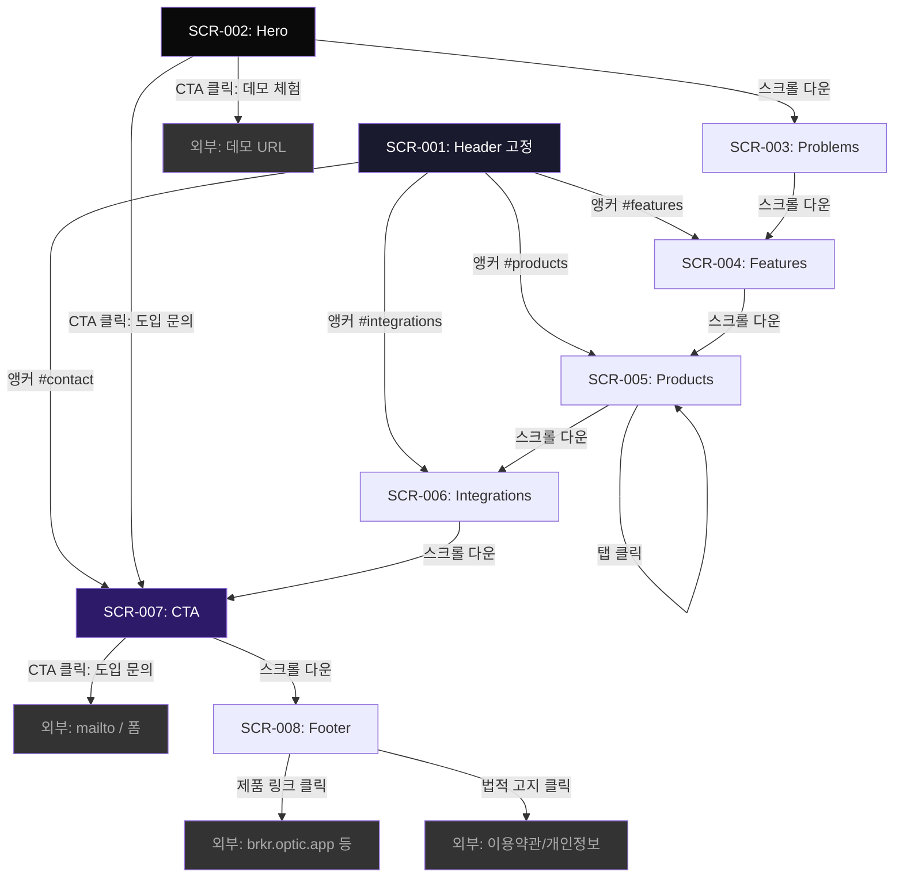

# Archive: OPTIC 랜딩 페이지

> **Key**: OLP | **Slug**: optic-landing-page | **IDEA**: IDEA-001
> **Category**: Lite | **RICE Score**: 80.25 | **Archived**: 2026-04-02
> **Code Location**: apps/landing/ | **Improvements**: 0
> **Pipeline**: P1(Idea) → P2(Screen) → P3(Draft) → P5(Wireframe) → P7(Bridge) → Dev → Archive

---

## 메타데이터

| 항목 | 값 |
|------|-----|
| Feature Key | OLP |
| Feature Slug | optic-landing-page |
| IDEA ID | IDEA-001 |
| Category | Lite |
| RICE Score | 80.25/100 |
| Verdict | Go |
| Pipeline Path | P1 → P2 → P3 → P5 → P7 → Dev → Archive |
| Code Location | apps/landing/ |
| Archived Date | 2026-04-02 |

## 원본 파일 매니페스트

| 원본 경로 | 현재 위치 | 유형 |
|----------|----------|------|
| .plans/ideas/IDEA-001.md | sources/IDEA-001.md | Idea |
| .plans/ideas/00-inbox/IDEA-001.md | sources/IDEA-001-inbox.md | Idea (inbox) |
| .plans/features/active/optic-landing-page.md | sources/optic-landing-page.md | Feature Overview |
| .plans/features/active/optic-landing-page/feature-plan-lite.md | sources/feature-plan-lite.md | Feature Plan |
| .plans/wireframes/optic-landing-page/screens.md | sources/wireframes/screens.md | Wireframe |
| .plans/wireframes/optic-landing-page/navigation.md | sources/wireframes/navigation.md | Wireframe |
| .plans/wireframes/optic-landing-page/components.md | sources/wireframes/components.md | Wireframe |
| .plans/bridge/optic-landing-page/01-overview.md | sources/bridge/01-overview.md | Bridge |
| .plans/bridge/optic-landing-page/02-wireframe-summary.md | sources/bridge/02-wireframe-summary.md | Bridge |
| .plans/bridge/optic-landing-page/03-dev-context.md | sources/bridge/03-dev-context.md | Bridge |

---

## 1. 아이디어 & 스크리닝

> 원본: `sources/IDEA-001.md`

- **카테고리**: feature
- **상태**: ready-to-dev (Go, 80.25점, Lite, Key: OLP)
- **등록일**: 2026-03-31
- **소스**: `.plan/idea/2026-03-31-optic-landing-page/`

---

### 요약

OPTIC 브랜드 공식 랜딩 페이지 제작. OpenAI Codex 페이지 스타일의 모던 디자인으로 OPTIC 제품 라인업(Broker, Shipper, Carrier, Operations, Billing)과 핵심 기능을 소개.

### 핵심 요구사항

1. **디자인 레퍼런스**: OpenAI Codex 페이지 (색감, 레이아웃, 전체 UX)
2. **브랜딩 적용**: OPTIC 브랜드 가이드 v1.0 준수
   - 외부 브랜드: OPTIC (OPTICS는 "Powered by OPTICS"로만)
   - 카피: "운송 운영을 한눈에 / 오더부터 정산까지"
3. **서비스 소개 콘텐츠**: handbook-claude 문서 기반 기능 정리
   - 주문 관리 / 배차 / 정산 / 세금계산서 / AI 주문서 추출 / 외부 연동
4. **제품 라인업 섹션**: 5개 제품별 역할/기능 소개
   - OPTIC Broker (주선사) — 오더 생성, 배차/진행, 정산, 거래처/차주 관리
   - OPTIC Shipper (화주) — 오더 생성/조회, 상하차지/거래처 관리
   - OPTIC Carrier (운송사/차주) — 배차/운송 수행, 상하차지 확인
   - OPTIC Operations (운영/관제) — 전체 현황 모니터링, 데이터 유지보수
   - OPTIC Billing (회계/정산) — 매출/매입 정산, 대사, 세금계산서
5. **도메인**: optic.app (메인 랜딩)

### 기술 스택 (현재 OPTIC 기반)

- Next.js 15.3 (App Router) + React 18 + TypeScript
- Tailwind CSS + shadcn/ui
- PostgreSQL + Drizzle ORM
- Vercel 배포

### 현재 구현된 서비스

- optic.app — 기본 웹서비스
- brkr.optic.app — 기본 주선사 웹서비스
- brkr.theu.optic.app — 주선사 '더유' 커스텀 웹서비스
- shpr.optic.app — 기본 화주 웹서비스

### 외부 연동

- Google Gemini AI (주문서 자동 추출)
- 카카오 맵 (주소 검색, 경로/거리 계산)
- 팝빌 (세금계산서 발행)
- 로지스엠/화물맨 (물류 플랫폼 연동)

### 스크리닝 결과 (RICE)

**스크리닝일**: 2026-03-31

| 축 | 가중치 | 점수 | 가중 점수 | 근거 |
|----|--------|------|-----------|------|
| 비즈니스 가치 | 30% | 85 | 25.5 | 브랜드 공식 진입점, 5개 제품 라인업 소개로 리드 생성 핵심 채널 |
| 사용자 영향 | 25% | 70 | 17.5 | 대상: 화주/주선사/운송사 의사결정자. 공식 랜딩 부재로 서비스 이해도 향상 |
| 기술적 실현성 | 20% | 90 | 18.0 | 기존 스택 100% 활용. 정적 페이지, 복잡도 낮음 |
| 전략적 정렬 | 15% | 85 | 12.75 | OPTIC 브랜드 가이드 v1.0 직접 구현. 제품 포지셔닝 공식화 |
| 긴급도 | 10% | 65 | 6.5 | 서비스 운영 중이나 공식 소개 페이지 부재 |

| 항목 | 값 |
|------|-----|
| **가중 합산 점수** | **80.25 / 100** |
| **판정** | **Go** |
| **카테고리** | **Lite** |

#### 리스크 요인

| 리스크 | 영향도 | 대응 |
|--------|--------|------|
| 디자인 품질 | 중 | OpenAI Codex 레퍼런스로 방향 명확 |
| 콘텐츠 완성도 | 중 | handbook-claude 8개 문서에서 기능 정보 충분 |
| 반응형 대응 | 낮 | Tailwind 유틸리티로 기본 대응 가능 |

### 참조 자료

- `.plan/idea/2026-03-31-optic-landing-page/memo.md`
- `.plan/idea/2026-03-31-optic-landing-page/optic-branding.md`
- `.references/code/mm-broker/docs/handbook-claude/` (8개 문서)

### 파이프라인 이력

| 단계 | 상태 | 산출물 |
|------|------|--------|
| Idea | done | `IDEA-001.md` |
| Screen | done | 80.25점, Go, Lite |
| Draft | done | `.plans/features/active/optic-landing-page.md` |
| Wireframe | done | `.plans/wireframes/optic-landing-page/` |
| Bridge | done | `.plans/bridge/optic-landing-page/` |
| Feature Plan | done | `.plans/features/active/optic-landing-page/feature-plan-lite.md` |
| Dev | done | `apps/landing/` |

---

## 2. 피처 오버뷰

> 원본: `sources/optic-landing-page.md`

> **IDEA**: IDEA-001 | **카테고리**: Lite | **판정**: Go (80.25점)
> **등록일**: 2026-03-31

---

### 1. 개요

#### 목적

OPTIC 브랜드 공식 랜딩 페이지를 제작하여 잠재 고객(화주, 주선사, 운송사)에게 제품 가치를 전달하고, 서비스 도입 문의를 유도한다.

#### 대상 사용자

| 사용자 | 니즈 |
|--------|------|
| 화주 (의사결정자) | 운송 의뢰 프로세스 간소화 솔루션 탐색 |
| 주선사 (대표/관리자) | 오더~정산 통합 관리 시스템 도입 검토 |
| 운송사/차주 | 배차 수락·운송 관리 디지털화 방안 검토 |

#### 성공 기준

- 페이지 로드 후 핵심 가치 전달까지 5초 이내 (First Meaningful Paint)
- 모든 섹션이 브랜딩 가이드 v1.0 준수
- 모바일/태블릿/데스크탑 반응형 정상 동작
- CTA(문의하기) 버튼 접근 가능

---

### 2. 유저 스토리

1. **화주 의사결정자**로서, 랜딩 페이지에서 OPTIC이 어떤 서비스인지 즉시 파악하고 싶다 → Hero 섹션 카피로 해결
2. **주선사 대표**로서, 현재 엑셀/수기 업무를 어떻게 대체하는지 구체적 기능을 알고 싶다 → Features 섹션으로 해결
3. **운송사 관리자**로서, 우리 역할에 맞는 제품이 있는지 확인하고 싶다 → Products 라인업 섹션으로 해결
4. **잠재 고객**으로서, 외부 시스템(세금계산서, 물류 플랫폼)과 연동 가능한지 알고 싶다 → Integrations 섹션으로 해결
5. **관심 고객**으로서, 도입 상담을 쉽게 요청하고 싶다 → CTA 섹션으로 해결

---

### 3. 페이지 섹션 구조

#### 3.1 Header (고정)

- OPTIC 로고 (좌측)
- 네비게이션: 기능 | 제품 | 연동 | 문의하기
- 스크롤 시 배경 블러 효과

#### 3.2 Hero 섹션

- **메인 카피**: "운송 운영을 한눈에"
- **서브 카피**: "오더부터 정산까지"
- **CTA 버튼**: "도입 문의하기" / "데모 체험하기"
- **비주얼**: 대시보드 스크린샷 또는 모션 그래픽
- **디자인**: OpenAI Codex 스타일 — 다크 배경, 그라데이션 악센트, 넓은 여백

#### 3.3 Problems 섹션

기존 물류 주선 업무의 페인포인트 → OPTIC 해결책 대비:

| 기존 문제 | OPTIC 해결 |
|-----------|-----------|
| 엑셀/수기 주문 관리 | 주문 등록·상태 추적·이력 자동화 |
| 배차 현황 파악 어려움 | 실시간 배차 상태 대시보드 |
| 정산/세금계산서 수작업 | 매출/매입 정산 자동 + 세금계산서 연동 |
| 외부 플랫폼 별도 관리 | 로지스엠(화물맨) 통합 연동 |
| 주소/경로 분산 검색 | 카카오 맵 통합 검색 |
| 주문서 반복 입력 | AI 기반 주문서 자동 추출 |

#### 3.4 Features 섹션

핵심 기능 카드 (아이콘 + 제목 + 설명):

1. **주문 관리** — 화물 등록부터 상태 추적까지 한 화면에서
2. **배차 관리** — 기사 배정, 진행 상황 실시간 모니터링
3. **정산 자동화** — 매출/매입 자동 계산, 대사 처리
4. **세금계산서** — 팝빌 연동 전자 세금계산서 발행
5. **AI 주문 추출** — Gemini AI로 주문서 텍스트 자동 인식
6. **지도 연동** — 카카오 맵 주소 검색, 경로·거리 계산

#### 3.5 Products 섹션

5개 제품 라인업 — 탭 또는 카드 레이아웃:

| 제품 | 대상 | 핵심 기능 |
|------|------|----------|
| **OPTIC Broker** | 주선사 | 오더 생성, 배차/진행, 정산, 거래처/차주 관리 |
| **OPTIC Shipper** | 화주 | 오더 생성/조회, 상하차지/거래처 관리 |
| **OPTIC Carrier** | 운송사/차주 | 배차 수락, 운송 수행, 상하차지 확인 |
| **OPTIC Operations** | 운영/관제팀 | 전체 현황 모니터링, 데이터 유지보수 |
| **OPTIC Billing** | 회계/정산 | 매출/매입 정산, 대사, 세금계산서 |

#### 3.6 Integrations 섹션

외부 연동 서비스 로고 + 설명:
- Google Gemini AI (주문서 자동 추출)
- 카카오 맵 (주소 검색, 경로 계산)
- 팝빌 (세금계산서 발행)
- 로지스엠/화물맨 (물류 플랫폼)

#### 3.7 CTA 섹션

- **카피**: "지금 시작하세요" / "OPTIC으로 운송 운영을 바꿔보세요"
- **버튼**: "도입 문의하기" (이메일/폼 연결)
- 다크 배경 + 그라데이션 강조

#### 3.8 Footer

- OPTIC 로고
- "Powered by OPTICS" (브랜딩 가이드 준수)
- 회사 정보, 이용약관, 개인정보처리방침 링크
- 도메인: optic.app

---

### 4. 기술 구현 방향

#### 4.1 프로젝트 위치

```
apps/landing/
├── app/
│   ├── layout.tsx          # 루트 레이아웃 (메타데이터, 폰트)
│   ├── page.tsx            # 메인 랜딩 페이지
│   └── globals.css         # 글로벌 스타일
├── components/
│   ├── header.tsx          # 네비게이션 헤더
│   ├── hero-section.tsx    # Hero 섹션
│   ├── problems-section.tsx # 문제 해결 대비 섹션
│   ├── features-section.tsx # 핵심 기능 섹션
│   ├── products-section.tsx # 제품 라인업 섹션
│   ├── integrations-section.tsx # 외부 연동 섹션
│   ├── cta-section.tsx     # CTA 섹션
│   └── footer.tsx          # 푸터
├── lib/
│   └── constants.ts        # 카피, 제품 데이터 등 상수
├── public/
│   └── images/             # 로고, 아이콘, 스크린샷
├── package.json
├── next.config.ts
├── tailwind.config.ts
└── tsconfig.json
```

#### 4.2 기술 스택

- **Next.js 15** (App Router, 정적 생성)
- **React 19** + **TypeScript**
- **Tailwind CSS v4** + **shadcn/ui** (버튼, 카드 등 기본 컴포넌트)
- **Framer Motion** (스크롤 애니메이션, 섹션 전환 효과)
- **Vercel** 배포 (optic.app 도메인)

#### 4.3 디자인 레퍼런스

OpenAI Codex 페이지 스타일 요소:
- **색상**: 다크 배경 (#0a0a0a ~ #1a1a2e), 밝은 악센트 그라데이션
- **타이포그래피**: 대형 헤딩, 넓은 행간, 모노스페이스 악센트
- **레이아웃**: 풀스크린 Hero, 카드 그리드, 넓은 여백
- **애니메이션**: 스크롤 기반 페이드인, 부드러운 전환
- **반응형**: 모바일 우선 → 태블릿 → 데스크탑

---

### 5. 구현 범위

#### In-Scope

- 단일 페이지 랜딩 (8개 섹션)
- 반응형 디자인 (모바일/태블릿/데스크탑)
- 스크롤 애니메이션
- CTA 버튼 (mailto: 또는 외부 폼 링크)
- SEO 메타데이터 (Open Graph, Twitter Card)
- OPTIC 브랜딩 가이드 v1.0 적용

#### Out-of-Scope

- 문의 폼 백엔드 (외부 서비스 연결로 대체)
- 다국어 지원 (초기 한국어 단일)
- 블로그/뉴스 섹션
- 로그인/회원가입 기능
- A/B 테스트 인프라
- 실제 대시보드 데모 페이지

---

### 6. 완료 기준 (Definition of Done)

- [ ] 8개 섹션 모두 구현 및 브랜딩 가이드 준수
- [ ] 모바일/태블릿/데스크탑 반응형 정상 동작
- [ ] Lighthouse Performance 90+, Accessibility 90+
- [ ] 빌드 성공 (0 에러)
- [ ] Vercel 프리뷰 배포 확인

---

### 7. 참조 자료

- `.plan/idea/2026-03-31-optic-landing-page/memo.md`
- `.plan/idea/2026-03-31-optic-landing-page/optic-branding.md`
- `.references/code/mm-broker/docs/handbook-claude/` (8개 문서)
- `.plans/ideas/screening-matrix.md` (RICE 스크리닝 결과)

---

### 다음 단계

`/dev-feature optic-landing-page` (Lite 개발 착수)

---

## 3. 피처 플랜

> 원본: `sources/feature-plan-lite.md`

> **Key**: OLP | **Slug**: optic-landing-page | **판정**: Lite (Go, 80.25점)
> **생성일**: 2026-03-31

---

### 1. 기본 정보

| 항목 | 값 |
|------|-----|
| Feature Key | OLP |
| Slug | optic-landing-page |
| IDEA | IDEA-001 |
| Lite 근거 | 상태머신 없음, 외부 연동 없음, API/DB 없음, 고위험 도메인 아님 |
| 프로젝트 위치 | `apps/landing/` (신규) |

#### 소스 산출물

| 산출물 | 경로 |
|--------|------|
| Feature Overview | `.plans/features/active/optic-landing-page.md` |
| Wireframe Screens | `.plans/wireframes/optic-landing-page/screens.md` |
| Wireframe Navigation | `.plans/wireframes/optic-landing-page/navigation.md` |
| Wireframe Components | `.plans/wireframes/optic-landing-page/components.md` |
| Bridge Overview | `.plans/bridge/optic-landing-page/01-overview.md` |
| Bridge Wireframe Summary | `.plans/bridge/optic-landing-page/02-wireframe-summary.md` |
| Bridge Dev Context | `.plans/bridge/optic-landing-page/03-dev-context.md` |
| 브랜딩 가이드 | `.plan/idea/2026-03-31-optic-landing-page/optic-branding.md` |

---

### 2. 요구사항 (OLP-REQ)

#### 기능 요구사항

| ID | 요구사항 | 섹션 | 우선순위 |
|----|---------|------|---------|
| OLP-REQ-001 | 고정 헤더에 OPTIC 로고, 4개 앵커 네비(기능/제품/연동/문의), CTA 버튼 표시 | SCR-001 | P0 |
| OLP-REQ-002 | 스크롤 시(scrollY >= 100px) 헤더 배경에 블러 효과 적용 | SCR-001 | P1 |
| OLP-REQ-003 | 모바일에서 햄버거 메뉴로 전환, 클릭 시 풀스크린 오버레이 메뉴 표시 | SCR-001 | P0 |
| OLP-REQ-004 | Hero 섹션에 메인 카피("운송 운영을 한눈에"), 서브 카피("오더부터 정산까지") 표시 | SCR-002 | P0 |
| OLP-REQ-005 | Hero에 Primary CTA("도입 문의하기" → #contact 스크롤), Secondary CTA("데모 체험하기" → 외부 링크) 배치 | SCR-002 | P0 |
| OLP-REQ-006 | Hero에 대시보드 프리뷰 비주얼(이미지 또는 모션) 표시 | SCR-002 | P1 |
| OLP-REQ-007 | Hero 배경에 그라데이션 glow 장식 효과 | SCR-002 | P2 |
| OLP-REQ-008 | Problems 섹션에 6개 Before/After 대비 카드 표시 | SCR-003 | P0 |
| OLP-REQ-009 | Features 섹션에 6개 핵심 기능 카드(아이콘+제목+설명) 3x2 그리드 표시 | SCR-004 | P0 |
| OLP-REQ-010 | Feature 카드 hover 시 lift(-4px) + glow 효과 | SCR-004 | P1 |
| OLP-REQ-011 | Products 섹션에 5개 제품 탭(Broker/Shipper/Carrier/Operations/Billing) 전환 | SCR-005 | P0 |
| OLP-REQ-012 | 탭 전환 시 콘텐츠 fade 애니메이션 (0.3s) | SCR-005 | P1 |
| OLP-REQ-013 | Integrations 섹션에 4개 외부 연동 서비스 카드(로고+이름+설명) 표시 | SCR-006 | P0 |
| OLP-REQ-014 | CTA 섹션에 그라데이션 배경 + 대형 CTA 버튼("도입 문의하기") | SCR-007 | P0 |
| OLP-REQ-015 | Footer에 3열 링크(제품/회사/법적), "Powered by OPTICS", 저작권 표시 | SCR-008 | P0 |

#### 반응형 요구사항

| ID | 요구사항 | 우선순위 |
|----|---------|---------|
| OLP-REQ-016 | Desktop(1280px+): 3열 그리드, 탭 네비, padding 80px | P0 |
| OLP-REQ-017 | Tablet(768-1279px): 2열 그리드, padding 40px | P0 |
| OLP-REQ-018 | Mobile(~767px): 1열, 풀폭 버튼, 햄버거 메뉴, 스와이프 탭, padding 20px | P0 |

#### 디자인/브랜딩 요구사항

| ID | 요구사항 | 우선순위 |
|----|---------|---------|
| OLP-REQ-019 | 다크 테마: bg #0a0a0a, text white, secondary gray-400, accent purple→blue gradient | P0 |
| OLP-REQ-020 | OpenAI Codex 스타일: 대형 헤딩, 넓은 여백, 카드 그리드 | P0 |
| OLP-REQ-021 | OPTIC 브랜딩 가이드 v1.0 준수 (외부=OPTIC, Footer만 "Powered by OPTICS") | P0 |
| OLP-REQ-022 | 스크롤 기반 섹션 fade-in-up 애니메이션 (0.6s, staggered) | P1 |

#### 비기능 요구사항

| ID | 요구사항 | 우선순위 |
|----|---------|---------|
| OLP-REQ-023 | Lighthouse Performance >= 90 | P0 |
| OLP-REQ-024 | Lighthouse Accessibility >= 90 | P0 |
| OLP-REQ-025 | 빌드 성공 (0 에러), Static Export (`output: "export"`) | P0 |
| OLP-REQ-026 | SEO 메타데이터: title, description, OpenGraph, Twitter Card | P1 |
| OLP-REQ-027 | 한국어 폰트 지원 (Inter + Pretendard) | P0 |

---

### 3. UI 스펙 요약

#### 컴포넌트 → 파일 매핑

| 컴포넌트 | 파일 | 와이어프레임 | 핵심 상태 |
|----------|------|------------|----------|
| Header | `src/components/sections/header.tsx` | SCR-001 | transparent / blurred |
| MobileMenu | `src/components/shared/mobile-menu.tsx` | SCR-001 | hidden / visible |
| Hero | `src/components/sections/hero.tsx` | SCR-002 | 정적 |
| Problems | `src/components/sections/problems.tsx` | SCR-003 | 정적 + scroll fade |
| Features | `src/components/sections/features.tsx` | SCR-004 | default / hover |
| Products | `src/components/sections/products.tsx` | SCR-005 | 탭 active 상태 |
| Integrations | `src/components/sections/integrations.tsx` | SCR-006 | 정적 |
| CTA | `src/components/sections/cta.tsx` | SCR-007 | 정적 |
| Footer | `src/components/sections/footer.tsx` | SCR-008 | 정적 |
| SectionWrapper | `src/components/shared/section-wrapper.tsx` | 공통 | 정적 + scroll fade |
| GradientBlob | `src/components/shared/gradient-blob.tsx` | 공통 | 정적 |
| Button | `src/components/ui/button.tsx` | 공통 | default / hover / active |
| Tabs | `src/components/ui/tabs.tsx` | SCR-005 | default / active |

#### 디자인 토큰

| 토큰 | 값 |
|------|-----|
| bg-primary | #0a0a0a |
| bg-card | gray-900/50 |
| border-card | gray-800 |
| text-primary | white |
| text-secondary | gray-400 |
| accent-start | purple-600 |
| accent-end | blue-600 |
| font-heading-desktop | 48-64px |
| font-heading-mobile | 28-32px |
| spacing-section-desktop | 120px |
| spacing-section-mobile | 80px |
| radius-xl | 12px |
| radius-lg | 8px |

---

### 4. 개발 태스크 (OLP-TASK)

#### Phase 1: 프로젝트 스캐폴딩

| ID | 태스크 | REQ 매핑 | 의존성 |
|----|--------|---------|--------|
| OLP-TASK-001 | `apps/landing/package.json` 생성 (@mologado/landing, scripts, deps) | OLP-REQ-025 | - |
| OLP-TASK-002 | `apps/landing/tsconfig.json` 생성 (extends tsconfig.base.json) | OLP-REQ-025 | - |
| OLP-TASK-003 | `apps/landing/next.config.ts` 생성 (output: export, optimizePackageImports) | OLP-REQ-025 | - |
| OLP-TASK-004 | `apps/landing/postcss.config.mjs` 생성 | OLP-REQ-019 | - |
| OLP-TASK-005 | `apps/landing/vitest.config.ts` 생성 | OLP-REQ-025 | - |
| OLP-TASK-006 | `src/app/globals.css` 생성 (Tailwind v4 + 다크 디자인 토큰) | OLP-REQ-019 | TASK-004 |
| OLP-TASK-007 | `src/app/layout.tsx` 생성 (Inter + Pretendard 폰트, 메타데이터) | OLP-REQ-027 | TASK-006 |
| OLP-TASK-008 | `src/app/page.tsx` 스텁 생성 | OLP-REQ-025 | TASK-007 |
| OLP-TASK-009 | `src/lib/utils.ts` 생성 (cn 유틸리티) | OLP-REQ-025 | - |
| OLP-TASK-010 | `pnpm install` + 빌드 검증 (dev 서버 3100, static export) | OLP-REQ-025 | TASK-001~009 |

#### Phase 2: 공통 컴포넌트 + 디자인 시스템

| ID | 태스크 | REQ 매핑 | 의존성 |
|----|--------|---------|--------|
| OLP-TASK-011 | shadcn/ui 초기화 (components.json) + Button 컴포넌트 (gradient variant 추가) | OLP-REQ-005, 014 | TASK-010 |
| OLP-TASK-012 | shadcn Tabs 컴포넌트 (다크 테마 스타일) | OLP-REQ-011 | TASK-011 |
| OLP-TASK-013 | `src/lib/motion.ts` (fadeInUp, staggerContainer, hoverLift, tabContent variants) | OLP-REQ-022 | TASK-010 |
| OLP-TASK-014 | `src/lib/constants.ts` (NAV_LINKS, PROBLEMS, FEATURES, PRODUCTS, INTEGRATIONS, FOOTER_LINKS) | 전체 | TASK-010 |
| OLP-TASK-015 | `src/components/shared/section-wrapper.tsx` (공통 래퍼 + fade-in) | OLP-REQ-016~018, 022 | TASK-013 |
| OLP-TASK-016 | `src/components/shared/gradient-blob.tsx` (장식용 glow) | OLP-REQ-007 | TASK-010 |
| OLP-TASK-017 | `src/components/icons/optic-logo.tsx` (SVG 컴포넌트) | OLP-REQ-001, 021 | TASK-010 |
| OLP-TASK-018 | `src/hooks/use-scroll-spy.ts` (IntersectionObserver 활성 섹션 추적) | OLP-REQ-001 | TASK-010 |
| OLP-TASK-019 | `src/hooks/use-media-query.ts` (SSR-safe 반응형 훅) | OLP-REQ-003 | TASK-010 |

#### Phase 3: 섹션 구현 (TDD)

| ID | 태스크 | REQ 매핑 | 의존성 |
|----|--------|---------|--------|
| OLP-TASK-020 | Header 섹션 (header.tsx + mobile-menu.tsx) | OLP-REQ-001~003 | TASK-015~019 |
| OLP-TASK-021 | Hero 섹션 (hero.tsx) | OLP-REQ-004~007 | TASK-015, 016 |
| OLP-TASK-022 | Problems 섹션 (problems.tsx) | OLP-REQ-008 | TASK-014, 015 |
| OLP-TASK-023 | Features 섹션 (features.tsx) | OLP-REQ-009~010 | TASK-013~015 |
| OLP-TASK-024 | Products 섹션 (products.tsx) | OLP-REQ-011~012 | TASK-012~015 |
| OLP-TASK-025 | Integrations 섹션 (integrations.tsx) | OLP-REQ-013 | TASK-014, 015 |
| OLP-TASK-026 | CTA 섹션 (cta.tsx) | OLP-REQ-014 | TASK-011, 015 |
| OLP-TASK-027 | Footer 섹션 (footer.tsx) | OLP-REQ-015, 021 | TASK-014, 017 |
| OLP-TASK-028 | page.tsx 조립 (8개 섹션 import + 렌더) | 전체 | TASK-020~027 |

#### Phase 4: SEO + 성능 최적화

| ID | 태스크 | REQ 매핑 | 의존성 |
|----|--------|---------|--------|
| OLP-TASK-029 | layout.tsx에 OpenGraph, Twitter Card 메타데이터 추가 | OLP-REQ-026 | TASK-028 |
| OLP-TASK-030 | sitemap.ts + robots.ts 생성 | OLP-REQ-026 | TASK-028 |
| OLP-TASK-031 | 이미지 최적화 (webp, lazy loading, 명시적 width/height) | OLP-REQ-023 | TASK-028 |
| OLP-TASK-032 | Lighthouse 감사 실행 (Performance >= 90, A11y >= 90) | OLP-REQ-023~024 | TASK-029~031 |

#### Phase 5: CI 통합

| ID | 태스크 | REQ 매핑 | 의존성 |
|----|--------|---------|--------|
| OLP-TASK-033 | `.claude/launch.json` 업데이트 (landing dev 서버 설정) | OLP-REQ-025 | TASK-010 |
| OLP-TASK-034 | 루트 빌드/테스트/타입체크 통합 검증 | OLP-REQ-025 | TASK-032 |

---

### 5. 테스트 케이스 (OLP-TC)

#### 컴포넌트 렌더링 테스트

| ID | 테스트 | REQ 매핑 | 파일 |
|----|--------|---------|------|
| OLP-TC-001 | Header: 로고, 4개 네비 링크, CTA 버튼 렌더 | OLP-REQ-001 | `__tests__/sections/header.test.tsx` |
| OLP-TC-002 | Header: 모바일 햄버거 아이콘 aria-label 존재 | OLP-REQ-003 | `__tests__/sections/header.test.tsx` |
| OLP-TC-003 | Hero: h1 "운송 운영을 한눈에" 텍스트 렌더 | OLP-REQ-004 | `__tests__/sections/hero.test.tsx` |
| OLP-TC-004 | Hero: 2개 CTA 버튼 렌더 (도입 문의 + 데모) | OLP-REQ-005 | `__tests__/sections/hero.test.tsx` |
| OLP-TC-005 | Problems: 6개 Before/After 카드 렌더 | OLP-REQ-008 | `__tests__/sections/problems.test.tsx` |
| OLP-TC-006 | Features: 6개 기능 카드 (제목+설명) 렌더 | OLP-REQ-009 | `__tests__/sections/features.test.tsx` |
| OLP-TC-007 | Products: 5개 탭 트리거 렌더 | OLP-REQ-011 | `__tests__/sections/products.test.tsx` |
| OLP-TC-008 | Products: 탭 클릭 시 콘텐츠 전환 | OLP-REQ-011 | `__tests__/sections/products.test.tsx` |
| OLP-TC-009 | Integrations: 4개 연동 카드 (이름) 렌더 | OLP-REQ-013 | `__tests__/sections/integrations.test.tsx` |
| OLP-TC-010 | CTA: 헤딩 + CTA 버튼 렌더 | OLP-REQ-014 | `__tests__/sections/cta.test.tsx` |
| OLP-TC-011 | Footer: 3개 링크 그룹 + 저작권 텍스트 렌더 | OLP-REQ-015 | `__tests__/sections/footer.test.tsx` |
| OLP-TC-012 | Footer: "Powered by OPTICS" 텍스트 존재 | OLP-REQ-021 | `__tests__/sections/footer.test.tsx` |

#### 통합 테스트

| ID | 테스트 | REQ 매핑 | 파일 |
|----|--------|---------|------|
| OLP-TC-013 | 전체 페이지: 8개 섹션 landmark(id) 존재 | 전체 | `__tests__/page.test.tsx` |
| OLP-TC-014 | SectionWrapper: children 렌더, id 속성 적용 | OLP-REQ-016~018 | `__tests__/shared/section-wrapper.test.tsx` |
| OLP-TC-015 | useScrollSpy: IntersectionObserver 기반 활성 섹션 반환 | OLP-REQ-001 | `__tests__/hooks/use-scroll-spy.test.tsx` |

#### 접근성 테스트

| ID | 테스트 | REQ 매핑 | 파일 |
|----|--------|---------|------|
| OLP-TC-016 | axe-core: 각 섹션 WCAG 2.1 AA 위반 없음 | OLP-REQ-024 | `__tests__/accessibility.test.tsx` |

#### 빌드 검증

| ID | 테스트 | REQ 매핑 | 검증 방법 |
|----|--------|---------|----------|
| OLP-TC-017 | Static export 빌드 성공 (exit 0) | OLP-REQ-025 | `pnpm --filter @mologado/landing build` |
| OLP-TC-018 | 타입체크 통과 (0 에러) | OLP-REQ-025 | `pnpm --filter @mologado/landing typecheck` |

---

### 6. 기술 결정

| 결정 | 선택 | 근거 |
|------|------|------|
| 렌더링 모드 | `output: "export"` (완전 정적) | API/DB/Auth 없음, CDN 최적, TTFB 최소 |
| 개발 서버 포트 | 3100 | mm-broker(3000) 충돌 방지 |
| 폰트 | Inter (next/font/google) + Pretendard (CDN) | 한국어 지원, font-display: swap |
| 이미지 | `` + 사전 최적화 webp | Static export에서 next/image 비활성 |
| 애니메이션 | Framer Motion | scroll-triggered fade-in, tab transition |
| UI 컴포넌트 | shadcn/ui (Button, Tabs) | 기존 스택 일관성 |
| 아이콘 | Lucide React | 기존 스택 일관성 |
| 테스트 | Vitest + Testing Library + vitest-axe | 컴포넌트 렌더링 + 접근성 |

---

### 7. 릴리스 체크리스트

- [ ] 모든 OLP-TC 통과 (18개)
- [ ] `pnpm --filter @mologado/landing build` 성공
- [ ] `pnpm --filter @mologado/landing typecheck` 성공
- [ ] Lighthouse Performance >= 90
- [ ] Lighthouse Accessibility >= 90
- [ ] 반응형 확인: 375px / 768px / 1280px
- [ ] 브랜딩 가이드 v1.0 준수 확인
- [ ] SEO 메타데이터 (OG, Twitter Card) 확인
- [ ] Vercel 프리뷰 배포 확인

---

### 다음 단계

`/dev optic-landing-page` → Phase D: TDD 기반 코드 구현 (OLP-TASK-001부터 순차 실행)

---

## 4. 와이어프레임

> 원본: `sources/wireframes/`

### 4.1 Screens

> Feature: optic-landing-page | 단일 페이지, 8개 섹션
> 디자인 레퍼런스: OpenAI Codex 스타일 (다크 배경, 그라데이션 악센트)

---

#### SCR-001: Header (고정)

##### Desktop (1280px+)

```
┌─────────────────────────────────────────────────────────────────────┐
│  [OPTIC Logo]          기능    제품    연동       [도입 문의하기]   │
│                        ~~~~    ~~~~    ~~~~       ~~~~~~~~~~~~~~~~  │
│                       anchor  anchor  anchor       CTA Button      │
└─────────────────────────────────────────────────────────────────────┘
  height: 64px | position: fixed | backdrop-blur on scroll
```

##### Mobile (~767px)

```
┌─────────────────────────────┐
│  [OPTIC Logo]         [☰]  │
│                      menu   │
└─────────────────────────────┘
  height: 56px | hamburger → slide-down menu
```

---

#### SCR-002: Hero 섹션

##### Desktop (1280px+)

```
┌─────────────────────────────────────────────────────────────────────┐
│                                                                     │
│                                                                     │
│                     ┌─────────────────────────┐                     │
│                     │     gradient glow bg     │                     │
│                     │                         │                     │
│                     │   운송 운영을 한눈에     │  ← h1, 48-64px     │
│                     │   오더부터 정산까지       │  ← p, 20-24px      │
│                     │                         │                     │
│                     │  [도입 문의하기] [데모]   │  ← 2x CTA buttons  │
│                     │                         │                     │
│                     └─────────────────────────┘                     │
│                                                                     │
│              ┌─────────────────────────────────────┐                │
│              │                                     │                │
│              │     Dashboard Screenshot / Motion    │  ← 비주얼     │
│              │         (mockup or animation)        │                │
│              │                                     │                │
│              └─────────────────────────────────────┘                │
│                                                                     │
└─────────────────────────────────────────────────────────────────────┘
  height: 100vh | dark bg (#0a0a0a) | center aligned | fade-in anim
```

##### Mobile (~767px)

```
┌─────────────────────────────┐
│                             │
│   운송 운영을 한눈에         │  ← h1, 32px
│   오더부터 정산까지           │  ← p, 16px
│                             │
│   [도입 문의하기]            │  ← full-width CTA
│   [데모 체험하기]            │  ← full-width secondary
│                             │
│  ┌───────────────────────┐  │
│  │  Dashboard Screenshot │  │
│  │      (smaller)        │  │
│  └───────────────────────┘  │
│                             │
└─────────────────────────────┘
  height: auto (min 100vh) | stacked layout
```

---

#### SCR-003: Problems 섹션

##### Desktop (1280px+)

```
┌─────────────────────────────────────────────────────────────────────┐
│                                                                     │
│              이런 문제, 겪고 계시지 않나요?           ← section title│
│                                                                     │
│  ┌──────────────────────────┐  ┌──────────────────────────┐        │
│  │ ❌ 엑셀/수기 주문 관리    │  │ ✅ 주문 등록·추적·이력    │        │
│  │    before               │  │    자동화                │        │
│  └──────────────────────────┘  └──────────────────────────┘        │
│  ┌──────────────────────────┐  ┌──────────────────────────┐        │
│  │ ❌ 배차 현황 파악 어려움   │  │ ✅ 실시간 배차 대시보드   │        │
│  └──────────────────────────┘  └──────────────────────────┘        │
│  ┌──────────────────────────┐  ┌──────────────────────────┐        │
│  │ ❌ 정산/세금계산서 수작업  │  │ ✅ 매출/매입 정산 자동    │        │
│  └──────────────────────────┘  └──────────────────────────┘        │
│  ┌──────────────────────────┐  ┌──────────────────────────┐        │
│  │ ❌ 외부 플랫폼 별도 관리  │  │ ✅ 로지스엠 통합 연동    │        │
│  └──────────────────────────┘  └──────────────────────────┘        │
│  ┌──────────────────────────┐  ┌──────────────────────────┐        │
│  │ ❌ 주소/경로 분산 검색    │  │ ✅ 카카오 맵 통합 검색   │        │
│  └──────────────────────────┘  └──────────────────────────┘        │
│  ┌──────────────────────────┐  ┌──────────────────────────┐        │
│  │ ❌ 주문서 반복 입력       │  │ ✅ AI 주문서 자동 추출   │        │
│  └──────────────────────────┘  └──────────────────────────┘        │
│                                                                     │
└─────────────────────────────────────────────────────────────────────┘
  2-column grid (before | after) | scroll-triggered fade-in per row
```

##### Mobile (~767px)

```
┌─────────────────────────────┐
│  이런 문제, 겪고 계시지      │
│  않나요?                     │
│                             │
│  ┌───────────────────────┐  │
│  │ ❌ 엑셀/수기 주문 관리 │  │
│  │ ↓                     │  │
│  │ ✅ 주문 자동화         │  │
│  └───────────────────────┘  │
│  ┌───────────────────────┐  │
│  │ ❌ 배차 파악 어려움    │  │
│  │ ↓                     │  │
│  │ ✅ 실시간 대시보드     │  │
│  └───────────────────────┘  │
│  ... (6개 항목 반복)         │
└─────────────────────────────┘
  single-column, before→after stacked per card
```

---

#### SCR-004: Features 섹션

##### Desktop (1280px+)

```
┌─────────────────────────────────────────────────────────────────────┐
│                                                                     │
│                     핵심 기능                      ← section title  │
│                                                                     │
│  ┌──────────────────┐  ┌──────────────────┐  ┌──────────────────┐  │
│  │    [icon]         │  │    [icon]         │  │    [icon]         │  │
│  │  주문 관리        │  │  배차 관리        │  │  정산 자동화      │  │
│  │  화물 등록부터    │  │  기사 배정,       │  │  매출/매입 자동   │  │
│  │  상태 추적까지    │  │  실시간 모니터링  │  │  계산, 대사 처리  │  │
│  └──────────────────┘  └──────────────────┘  └──────────────────┘  │
│  ┌──────────────────┐  ┌──────────────────┐  ┌──────────────────┐  │
│  │    [icon]         │  │    [icon]         │  │    [icon]         │  │
│  │  세금계산서       │  │  AI 주문 추출     │  │  지도 연동        │  │
│  │  팝빌 연동 전자   │  │  Gemini AI로     │  │  카카오 맵 주소   │  │
│  │  세금계산서 발행  │  │  텍스트 자동 인식 │  │  검색, 경로 계산  │  │
│  └──────────────────┘  └──────────────────┘  └──────────────────┘  │
│                                                                     │
└─────────────────────────────────────────────────────────────────────┘
  3x2 grid | card hover: subtle lift + glow | staggered fade-in
```

##### Tablet (768px-1279px)

```
  2x3 grid (2열 3행)
```

##### Mobile (~767px)

```
┌─────────────────────────────┐
│  핵심 기능                   │
│                             │
│  ┌───────────────────────┐  │
│  │ [icon]  주문 관리      │  │
│  │ 화물 등록~상태 추적    │  │
│  └───────────────────────┘  │
│  ┌───────────────────────┐  │
│  │ [icon]  배차 관리      │  │
│  │ 기사 배정, 실시간 모니 │  │
│  └───────────────────────┘  │
│  ... (6개 반복)              │
└─────────────────────────────┘
  single-column full-width cards
```

---

#### SCR-005: Products 섹션

##### Desktop (1280px+)

```
┌─────────────────────────────────────────────────────────────────────┐
│                                                                     │
│                     제품 라인업                     ← section title  │
│                     역할에 맞는 솔루션을 선택하세요                  │
│                                                                     │
│  ┌─────────────────────────────────────────────────────────────┐    │
│  │  [Broker]  [Shipper]  [Carrier]  [Operations]  [Billing]   │    │
│  │   ~~~~~~                                                   │    │
│  │   active tab                                               │    │
│  └─────────────────────────────────────────────────────────────┘    │
│                                                                     │
│  ┌─────────────────────────────────────────────────────────────┐    │
│  │                                                             │    │
│  │   OPTIC Broker                                              │    │
│  │   주선사를 위한 통합 운영 솔루션                              │    │
│  │                                                             │    │
│  │   ✓ 오더 생성 및 관리                                       │    │
│  │   ✓ 배차/진행 상태 추적                                     │    │
│  │   ✓ 매출/매입 정산                                          │    │
│  │   ✓ 거래처/차주 관리                                        │    │
│  │                                                             │    │
│  │          [product screenshot / illustration]                 │    │
│  │                                                             │    │
│  └─────────────────────────────────────────────────────────────┘    │
│                                                                     │
└─────────────────────────────────────────────────────────────────────┘
  tab navigation | content area with feature list + visual
```

##### Mobile (~767px)

```
┌─────────────────────────────┐
│  제품 라인업                 │
│                             │
│  ← [Broker] [Shipper] →    │  ← horizontal scroll tabs
│                             │
│  OPTIC Broker               │
│  주선사를 위한 통합 운영     │
│                             │
│  ✓ 오더 생성 및 관리        │
│  ✓ 배차/진행 상태 추적      │
│  ✓ 매출/매입 정산           │
│  ✓ 거래처/차주 관리         │
│                             │
│  [screenshot]               │
└─────────────────────────────┘
  swipeable tabs | stacked content
```

---

#### SCR-006: Integrations 섹션

##### Desktop (1280px+)

```
┌─────────────────────────────────────────────────────────────────────┐
│                                                                     │
│                  외부 시스템과 연결됩니다            ← section title │
│                                                                     │
│  ┌──────────────┐  ┌──────────────┐  ┌──────────────┐  ┌────────┐ │
│  │  [Gemini     │  │  [Kakao      │  │  [Popbill    │  │[Logishm│ │
│  │   Logo]      │  │   Logo]      │  │   Logo]      │  │ Logo]  │ │
│  │              │  │              │  │              │  │        │ │
│  │ Google       │  │ 카카오 맵     │  │ 팝빌         │  │로지스엠│ │
│  │ Gemini AI    │  │              │  │              │  │        │ │
│  │              │  │ 주소 검색,   │  │ 세금계산서    │  │물류    │ │
│  │ 주문서 자동  │  │ 경로 계산    │  │ 발행         │  │플랫폼  │ │
│  │ 추출         │  │              │  │              │  │연동    │ │
│  └──────────────┘  └──────────────┘  └──────────────┘  └────────┘ │
│                                                                     │
└─────────────────────────────────────────────────────────────────────┘
  4-column grid | logo + name + description | hover glow
```

##### Mobile (~767px)

```
┌─────────────────────────────┐
│  외부 시스템과 연결됩니다    │
│                             │
│  ┌───────────────────────┐  │
│  │ [Logo] Gemini AI      │  │
│  │ 주문서 자동 추출       │  │
│  └───────────────────────┘  │
│  ┌───────────────────────┐  │
│  │ [Logo] 카카오 맵       │  │
│  │ 주소 검색, 경로 계산   │  │
│  └───────────────────────┘  │
│  ... (4개 반복)              │
└─────────────────────────────┘
  single-column, logo left + text right
```

---

#### SCR-007: CTA 섹션

##### Desktop (1280px+)

```
┌─────────────────────────────────────────────────────────────────────┐
│  ░░░░░░░░░░░░░░░░░░░░░░░░░░░░░░░░░░░░░░░░░░░░░░░░░░░░░░░░░░░░░  │
│  ░░░░░░░░░░░░░░░░  gradient background  ░░░░░░░░░░░░░░░░░░░░░░░  │
│  ░░░░░░░░░░░░░░░░░░░░░░░░░░░░░░░░░░░░░░░░░░░░░░░░░░░░░░░░░░░░░  │
│                                                                     │
│              OPTIC으로 운송 운영을 바꿔보세요         ← h2          │
│              지금 시작하세요                          ← subtitle    │
│                                                                     │
│                      [도입 문의하기]                  ← large CTA   │
│                                                                     │
│  ░░░░░░░░░░░░░░░░░░░░░░░░░░░░░░░░░░░░░░░░░░░░░░░░░░░░░░░░░░░░░  │
└─────────────────────────────────────────────────────────────────────┘
  full-width | dark bg + gradient accent | center aligned
```

##### Mobile (~767px)

```
┌─────────────────────────────┐
│  ░░░░░░░░░░░░░░░░░░░░░░░░  │
│                             │
│  OPTIC으로 운송 운영을       │
│  바꿔보세요                  │
│                             │
│  [도입 문의하기]             │  ← full-width CTA
│                             │
│  ░░░░░░░░░░░░░░░░░░░░░░░░  │
└─────────────────────────────┘
```

---

#### SCR-008: Footer

##### Desktop (1280px+)

```
┌─────────────────────────────────────────────────────────────────────┐
│                                                                     │
│  [OPTIC Logo]                                                       │
│                                                                     │
│  제품           회사             법적 고지                           │
│  ─────          ─────            ─────────                          │
│  Broker         회사 소개         이용약관                           │
│  Shipper        채용              개인정보처리방침                   │
│  Carrier                                                            │
│  Operations                                                         │
│  Billing                                                            │
│                                                                     │
│  ─────────────────────────────────────────────────────────────────  │
│  Powered by OPTICS              © 2026 OPTIC. All rights reserved. │
│                                                                     │
└─────────────────────────────────────────────────────────────────────┘
  3-column grid + bottom bar | dark bg (#0a0a0a)
```

##### Mobile (~767px)

```
┌─────────────────────────────┐
│  [OPTIC Logo]               │
│                             │
│  제품                        │
│  Broker · Shipper · Carrier │
│  Operations · Billing       │
│                             │
│  회사                        │
│  회사 소개 · 채용            │
│                             │
│  법적 고지                   │
│  이용약관 · 개인정보처리방침 │
│                             │
│  ───────────────────────── │
│  Powered by OPTICS          │
│  © 2026 OPTIC               │
└─────────────────────────────┘
  stacked sections | inline links
```

---

#### 반응형 브레이크포인트 요약

| 뷰포트 | 너비 | 주요 레이아웃 변경 |
|---------|------|-------------------|
| Desktop | 1280px+ | 3열 그리드, 탭 네비게이션, 넓은 여백 |
| Tablet | 768px-1279px | 2열 그리드, 여백 축소 |
| Mobile | ~767px | 1열, 풀폭 버튼, 햄버거 메뉴, 스와이프 탭 |

### 4.2 Navigation

> 단일 페이지 스크롤 기반 네비게이션. 화면 전환 없음.

---

#### 스크롤 네비게이션 플로우



#### 인터랙션 상세

##### Header 앵커 링크

| 링크 텍스트 | 대상 섹션 | 동작 |
|-------------|----------|------|
| 기능 | SCR-004: Features | smooth scroll to `#features` |
| 제품 | SCR-005: Products | smooth scroll to `#products` |
| 연동 | SCR-006: Integrations | smooth scroll to `#integrations` |
| 도입 문의하기 | SCR-007: CTA | smooth scroll to `#contact` |

##### CTA 버튼

| 위치 | 버튼 텍스트 | 동작 |
|------|-----------|------|
| SCR-002 Hero | 도입 문의하기 | scroll to `#contact` |
| SCR-002 Hero | 데모 체험하기 | 외부 링크 (새 탭) |
| SCR-007 CTA | 도입 문의하기 | mailto: 또는 외부 폼 (새 탭) |

##### Header 스크롤 동작

| 상태 | 조건 | 스타일 |
|------|------|--------|
| 투명 | scrollY < 100px | background: transparent |
| 블러 | scrollY >= 100px | background: rgba(10,10,10,0.8) + backdrop-blur(12px) |

##### Products 탭 인터랙션

| 동작 | 결과 |
|------|------|
| 탭 클릭 (Desktop) | 해당 제품 콘텐츠로 전환 (애니메이션) |
| 스와이프 (Mobile) | 탭 가로 스크롤 + 콘텐츠 전환 |

#### 외부 링크

| 대상 | URL 패턴 | 열기 방식 |
|------|----------|----------|
| 데모 체험 | TBD (별도 결정) | 새 탭 |
| 도입 문의 | mailto:contact@optic.app 또는 외부 폼 | 새 탭 |
| Broker 앱 | brkr.optic.app | 새 탭 |
| Shipper 앱 | shpr.optic.app | 새 탭 |
| 이용약관 | TBD | 새 탭 |
| 개인정보처리방침 | TBD | 새 탭 |

### 4.3 Components

> 각 섹션의 UI 컴포넌트 타입, 상태, 동작, 반응형 변형 정의

---

#### 공통 컴포넌트

##### SectionWrapper


| 속성      | 값                                            |
| ------- | -------------------------------------------- |
| 타입      | Container                                    |
| 역할      | 모든 섹션의 공통 래퍼 (max-width, padding, id anchor) |
| Desktop | max-width: 1280px, padding: 0 80px           |
| Tablet  | padding: 0 40px                              |
| Mobile  | padding: 0 20px                              |


##### SectionTitle


| 속성      | 값                                                     |
| ------- | ----------------------------------------------------- |
| 타입      | Typography (h2)                                       |
| Desktop | font-size: 40px, font-weight: 700, text-align: center |
| Mobile  | font-size: 28px                                       |
| 애니메이션   | scroll-triggered fade-in-up                           |


##### SectionSubtitle


| 속성      | 값                                                    |
| ------- | ---------------------------------------------------- |
| 타입      | Typography (p)                                       |
| Desktop | font-size: 18px, color: gray-400, text-align: center |
| Mobile  | font-size: 16px                                      |


---

#### SCR-001: Header 컴포넌트


| 컴포넌트               | 타입        | 상태                       | 동작                            | 반응형             |
| ------------------ | --------- | ------------------------ | ----------------------------- | --------------- |
| Logo               | Image/SVG | default                  | 클릭 → scroll to top            | 모든 뷰포트          |
| NavLink            | Anchor    | default / hover / active | 클릭 → smooth scroll to section | Desktop/Tablet만 |
| CTAButton (Header) | Button    | default / hover          | 클릭 → scroll to #contact       | Desktop/Tablet만 |
| HamburgerIcon      | Button    | closed / open            | 클릭 → mobile menu toggle       | Mobile만         |
| MobileMenu         | Overlay   | hidden / visible         | slide-down 메뉴, NavLink 목록     | Mobile만         |


##### NavLink 상태


| 상태                   | 스타일                            |
| -------------------- | ------------------------------ |
| default              | color: gray-300, no underline  |
| hover                | color: white, subtle underline |
| active (in viewport) | color: white, underline accent |


---

#### SCR-002: Hero 컴포넌트


| 컴포넌트         | 타입              | 상태                       | 동작                       | 반응형                                  |
| ------------ | --------------- | ------------------------ | ------------------------ | ------------------------------------ |
| HeroTitle    | Typography (h1) | default                  | 페이지 로드 시 fade-in         | Desktop: 48-64px / Mobile: 32px      |
| HeroSubtitle | Typography (p)  | default                  | 페이지 로드 시 fade-in (delay) | Desktop: 20-24px / Mobile: 16px      |
| PrimaryCTA   | Button          | default / hover / active | 클릭 → scroll to #contact  | Desktop: inline / Mobile: full-width |
| SecondaryCTA | Button          | default / hover / active | 클릭 → 외부 데모 링크 (새 탭)      | Desktop: inline / Mobile: full-width |
| HeroVisual   | Image/Animation | loading / loaded         | 페이지 로드 시 fade-in (delay) | Desktop: 넓은 폭 / Mobile: 축소           |
| GradientGlow | Decorative      | default                  | 배경 그라데이션 효과              | 모든 뷰포트                               |


##### Button 변형


| 변형              | 스타일                                                                         |
| --------------- | --------------------------------------------------------------------------- |
| Primary (도입 문의) | bg: accent gradient, color: white, px: 32, py: 16, rounded-lg               |
| Secondary (데모)  | bg: transparent, border: 1px gray-600, color: gray-200, hover: border-white |


---

#### SCR-003: Problems 컴포넌트


| 컴포넌트        | 타입         | 상태      | 동작                                   | 반응형                              |
| ----------- | ---------- | ------- | ------------------------------------ | -------------------------------- |
| ProblemCard | Card       | default | scroll-triggered fade-in (staggered) | Desktop: 2열 / Mobile: 1열 stacked |
| BeforeLabel | Badge      | default | 정적                                   | ❌ 빨간 악센트                         |
| AfterLabel  | Badge      | default | 정적                                   | ✅ 녹색 악센트                         |
| BeforeText  | Typography | default | 정적                                   | 취소선 또는 흐린 색상                     |
| AfterText   | Typography | default | 정적                                   | 밝은 색상, 강조                        |


---

#### SCR-004: Features 컴포넌트


| 컴포넌트               | 타입              | 상태              | 동작                                                  | 반응형                                   |
| ------------------ | --------------- | --------------- | --------------------------------------------------- | ------------------------------------- |
| FeatureCard        | Card            | default / hover | hover: subtle lift + glow, scroll-triggered fade-in | Desktop: 3열 / Tablet: 2열 / Mobile: 1열 |
| FeatureIcon        | Icon/SVG        | default         | 정적                                                  | 40x40px                               |
| FeatureTitle       | Typography (h3) | default         | 정적                                                  | font-size: 20px, font-weight: 600     |
| FeatureDescription | Typography (p)  | default         | 정적                                                  | font-size: 14px, color: gray-400      |


##### FeatureCard 상태


| 상태      | 스타일                                                                    |
| ------- | ---------------------------------------------------------------------- |
| default | bg: gray-900/50, border: 1px gray-800, rounded-xl, p: 24               |
| hover   | transform: translateY(-4px), border-color: accent/30, box-shadow: glow |


---

#### SCR-005: Products 컴포넌트


| 컴포넌트               | 타입              | 상태               | 동작                | 반응형                           |
| ------------------ | --------------- | ---------------- | ----------------- | ----------------------------- |
| ProductTab         | Tab             | default / active | 클릭 → 제품 콘텐츠 전환    | Desktop: 가로 탭바 / Mobile: 스와이프 |
| ProductContent     | Panel           | hidden / visible | 탭 전환 시 fade 애니메이션 | 모든 뷰포트                        |
| ProductTitle       | Typography (h3) | default          | 정적                | font-size: 28px               |
| ProductDescription | Typography (p)  | default          | 정적                | font-size: 16px               |
| ProductFeatureList | List            | default          | 정적                | ✓ prefix, 각 항목                |
| ProductVisual      | Image           | loading / loaded | 탭 전환 시 fade-in    | Desktop: 우측 배치 / Mobile: 하단   |


##### ProductTab 상태


| 상태      | 스타일                                     |
| ------- | --------------------------------------- |
| default | color: gray-400, border-bottom: none    |
| hover   | color: gray-200                         |
| active  | color: white, border-bottom: 2px accent |


##### 제품 데이터


| Tab Key    | 라벨               | 설명                  | 기능 목록                       |
| ---------- | ---------------- | ------------------- | --------------------------- |
| broker     | OPTIC Broker     | 주선사를 위한 통합 운영 솔루션   | 오더 생성, 배차/진행, 정산, 거래처/차주 관리 |
| shipper    | OPTIC Shipper    | 화주를 위한 운송 요청 솔루션    | 오더 생성/조회, 상하차지/거래처 관리       |
| carrier    | OPTIC Carrier    | 운송사/차주를 위한 배차 솔루션   | 배차 수락, 운송 수행, 상하차지 확인       |
| operations | OPTIC Operations | 운영/관제팀을 위한 모니터링 솔루션 | 전체 현황 모니터링, 데이터 유지보수        |
| billing    | OPTIC Billing    | 회계/정산 담당을 위한 정산 솔루션 | 매출/매입 정산, 대사, 세금계산서         |


---

#### SCR-006: Integrations 컴포넌트


| 컴포넌트            | 타입              | 상태              | 동작                                    | 반응형                                   |
| --------------- | --------------- | --------------- | ------------------------------------- | ------------------------------------- |
| IntegrationCard | Card            | default / hover | hover: glow, scroll-triggered fade-in | Desktop: 4열 / Tablet: 2열 / Mobile: 1열 |
| IntegrationLogo | Image           | default         | 정적                                    | 48x48px 또는 64x64px                    |
| IntegrationName | Typography (h4) | default         | 정적                                    | font-size: 18px, font-weight: 600     |
| IntegrationDesc | Typography (p)  | default         | 정적                                    | font-size: 14px, color: gray-400      |


##### 연동 데이터


| Key     | 로고               | 이름               | 설명           |
| ------- | ---------------- | ---------------- | ------------ |
| gemini  | Google Gemini 로고 | Google Gemini AI | 주문서 자동 추출    |
| kakao   | 카카오 맵 로고         | 카카오 맵            | 주소 검색, 경로 계산 |
| popbill | 팝빌 로고            | 팝빌               | 세금계산서 발행     |
| logishm | 로지스엠 로고          | 로지스엠/화물맨         | 물류 플랫폼 연동    |


---

#### SCR-007: CTA 컴포넌트


| 컴포넌트             | 타입              | 상태                       | 동작                       | 반응형                                |
| ---------------- | --------------- | ------------------------ | ------------------------ | ---------------------------------- |
| CTATitle         | Typography (h2) | default                  | scroll-triggered fade-in | Desktop: 36px / Mobile: 28px       |
| CTASubtitle      | Typography (p)  | default                  | fade-in (delay)          | Desktop: 18px / Mobile: 16px       |
| CTAButton (Main) | Button          | default / hover / active | 클릭 → mailto 또는 외부 폼      | Desktop: auto / Mobile: full-width |
| GradientBg       | Decorative      | default                  | 정적 그라데이션 배경              | 모든 뷰포트                             |


---

#### SCR-008: Footer 컴포넌트


| 컴포넌트              | 타입                | 상태              | 동작               | 반응형                                                |
| ----------------- | ----------------- | --------------- | ---------------- | -------------------------------------------------- |
| FooterLogo        | Image/SVG         | default         | 정적               | 모든 뷰포트                                             |
| FooterColumnTitle | Typography (h4)   | default         | 정적               | font-size: 14px, font-weight: 600, color: gray-200 |
| FooterLink        | Anchor            | default / hover | 클릭 → 외부 링크 (새 탭) | Desktop: 열 배치 / Mobile: inline                     |
| PoweredBy         | Typography (span) | default         | 정적               | "Powered by OPTICS", font-size: 12px               |
| Copyright         | Typography (span) | default         | 정적               | font-size: 12px, color: gray-500                   |
| Divider           | Decorative (hr)   | default         | 정적               | border: 1px gray-800                               |


##### Footer 링크 데이터


| 그룹    | 링크들                                           |
| ----- | --------------------------------------------- |
| 제품    | Broker, Shipper, Carrier, Operations, Billing |
| 회사    | 회사 소개, 채용                                     |
| 법적 고지 | 이용약관, 개인정보처리방침                                |


---

#### 애니메이션 명세


| 효과             | 적용 위치                        | 트리거                  | 상세                                                  |
| -------------- | ---------------------------- | -------------------- | --------------------------------------------------- |
| fade-in-up     | SectionTitle, 카드             | scroll into viewport | translateY(20px) → 0, opacity 0 → 1, duration: 0.6s |
| staggered-fade | ProblemCard, FeatureCard     | scroll into viewport | 각 카드 0.1s delay 추가                                  |
| tab-transition | ProductContent               | 탭 클릭                 | opacity 0 → 1, duration: 0.3s                       |
| header-blur    | Header bg                    | scrollY >= 100px     | background opacity 0 → 0.8, backdrop-blur 0 → 12px  |
| hover-lift     | FeatureCard                  | mouse enter/leave    | translateY(0) → -4px, duration: 0.2s                |
| glow           | FeatureCard, IntegrationCard | mouse enter/leave    | box-shadow accent color, duration: 0.3s             |


---

## 5. 브릿지

> 원본: `sources/bridge/`

### 5.1 Overview

> **IDEA**: IDEA-001 | **카테고리**: Lite | **판정**: Go (80.25점)
> **소스**: `.plans/features/active/optic-landing-page.md`

---

#### 목적

OPTIC 브랜드 공식 랜딩 페이지 제작. 잠재 고객(화주, 주선사, 운송사)에게 제품 가치를 전달하고 도입 문의를 유도.

#### 대상 사용자

| 사용자 | 니즈 |
|--------|------|
| 화주 (의사결정자) | 운송 의뢰 프로세스 간소화 솔루션 탐색 |
| 주선사 (대표/관리자) | 오더~정산 통합 관리 시스템 도입 검토 |
| 운송사/차주 | 배차 수락·운송 관리 디지털화 방안 검토 |

#### 성공 기준

- 핵심 가치 전달 5초 이내 (First Meaningful Paint)
- 브랜딩 가이드 v1.0 전 섹션 준수
- 모바일/태블릿/데스크탑 반응형 정상 동작
- CTA(문의하기) 버튼 접근 가능

#### 유저 스토리 (5개)

1. 화주 → Hero 카피로 서비스 즉시 파악
2. 주선사 → Features로 기존 업무 대체 기능 확인
3. 운송사 → Products로 역할별 제품 확인
4. 잠재 고객 → Integrations로 외부 연동 확인
5. 관심 고객 → CTA로 도입 상담 요청

#### 구현 범위

##### In-Scope
- 단일 페이지 8개 섹션 (Header, Hero, Problems, Features, Products, Integrations, CTA, Footer)
- 반응형 디자인 (Desktop/Tablet/Mobile)
- 스크롤 애니메이션
- CTA 버튼 (mailto 또는 외부 폼)
- SEO 메타데이터

##### Out-of-Scope
- 문의 폼 백엔드, 다국어, 블로그, 로그인, A/B 테스트, 데모 페이지

#### 완료 기준 (DoD)

- [ ] 8개 섹션 구현 + 브랜딩 가이드 준수
- [ ] 반응형 3단계 정상 동작
- [ ] Lighthouse Performance 90+, Accessibility 90+
- [ ] 빌드 성공 (0 에러)
- [ ] Vercel 프리뷰 배포 확인

### 5.2 Wireframe Summary

> **소스**: `.plans/wireframes/optic-landing-page/` (screens, navigation, components)

---

#### 페이지 구조 (8개 섹션)

| SCR | 섹션 | 핵심 요소 | 그리드 (Desktop) |
|-----|------|----------|-----------------|
| 001 | Header (고정) | 로고 + 네비게이션 4개 + CTA 버튼 | 단일 행 |
| 002 | Hero | 메인/서브 카피 + 2x CTA + 대시보드 비주얼 | 중앙 정렬, 100vh |
| 003 | Problems | Before/After 대비 6개 항목 | 2열 (before \| after) |
| 004 | Features | 6개 기능 카드 (아이콘+제목+설명) | 3x2 그리드 |
| 005 | Products | 5개 제품 탭 + 콘텐츠 패널 | 탭바 + 콘텐츠 영역 |
| 006 | Integrations | 4개 연동 서비스 카드 | 4열 그리드 |
| 007 | CTA | 카피 + 대형 CTA 버튼 | 중앙 정렬 |
| 008 | Footer | 3열 링크 + 하단 바 | 3열 + 풀폭 하단 |

#### 반응형 브레이크포인트

| 뷰포트 | 너비 | 주요 변경 |
|---------|------|----------|
| Desktop | 1280px+ | 3열 그리드, 탭 네비, 넓은 여백 |
| Tablet | 768-1279px | 2열 그리드, 여백 축소 |
| Mobile | ~767px | 1열, 풀폭 버튼, 햄버거 메뉴, 스와이프 탭 |

#### 핵심 인터랙션

| 인터랙션 | 트리거 | 동작 |
|----------|--------|------|
| Header 앵커 스크롤 | 네비 링크 클릭 | smooth scroll to 섹션 |
| Header 블러 | scrollY >= 100px | 배경 blur + opacity 전환 |
| 섹션 페이드인 | scroll into viewport | fade-in-up (0.6s, staggered) |
| Feature 카드 호버 | mouse enter | lift(-4px) + glow |
| Product 탭 전환 | 탭 클릭/스와이프 | 콘텐츠 fade 전환 (0.3s) |
| CTA 클릭 (Hero) | 버튼 클릭 | scroll to #contact |
| CTA 클릭 (문의) | 버튼 클릭 | mailto 또는 외부 폼 (새 탭) |

#### 디자인 토큰 (OpenAI Codex 스타일)

| 토큰 | 값 |
|------|-----|
| bg-primary | #0a0a0a |
| bg-card | gray-900/50 |
| border-card | gray-800 |
| text-primary | white |
| text-secondary | gray-400 |
| accent | gradient (purple → blue 계열) |
| font-heading | 48-64px (Desktop) / 28-32px (Mobile) |
| font-body | 16-18px |
| spacing-section | 120px (Desktop) / 80px (Mobile) |
| border-radius | xl (12px) / lg (8px) |

### 5.3 Dev Context

> `/dev-feature optic-landing-page` 진입 시 이 파일을 참조

---

#### 기술 스택

| 항목 | 선택 |
|------|------|
| 프레임워크 | Next.js 15 (App Router, Static Export) |
| UI | React 19 + TypeScript |
| 스타일 | Tailwind CSS v4 + shadcn/ui |
| 애니메이션 | Framer Motion |
| 배포 | Vercel (optic.app 도메인) |
| 패키지 매니저 | pnpm (workspace) |
| 빌드 | Turborepo |

#### 프로젝트 위치

```
apps/landing/                    ← 신규 생성
├── app/
│   ├── layout.tsx               # 루트 레이아웃 (메타데이터, 폰트, 글로벌 스타일)
│   ├── page.tsx                 # 메인 랜딩 (섹션 컴포넌트 조합)
│   └── globals.css              # Tailwind 글로벌 스타일
├── components/
│   ├── header.tsx               # SCR-001: 고정 헤더 + 네비게이션
│   ├── hero-section.tsx         # SCR-002: Hero (카피 + CTA + 비주얼)
│   ├── problems-section.tsx     # SCR-003: Before/After 대비
│   ├── features-section.tsx     # SCR-004: 6개 기능 카드 그리드
│   ├── products-section.tsx     # SCR-005: 5개 제품 탭
│   ├── integrations-section.tsx # SCR-006: 4개 연동 카드
│   ├── cta-section.tsx          # SCR-007: CTA
│   └── footer.tsx               # SCR-008: Footer
├── components/ui/               # 공통 UI (SectionWrapper, Button 등)
├── lib/
│   └── constants.ts             # 카피, 제품 데이터, 연동 데이터
├── public/
│   └── images/                  # 로고, 아이콘, 스크린샷
├── package.json
├── next.config.ts
├── tailwind.config.ts
└── tsconfig.json
```

#### 컴포넌트 → 와이어프레임 매핑

| 컴포넌트 파일 | 와이어프레임 | 핵심 참조 |
|--------------|------------|----------|
| `header.tsx` | SCR-001 | 고정, 앵커 스크롤, 스크롤 블러, 모바일 햄버거 |
| `hero-section.tsx` | SCR-002 | 100vh, 중앙 정렬, 2x CTA, 그라데이션 glow |
| `problems-section.tsx` | SCR-003 | 2열 Before/After, 6개 항목, staggered fade |
| `features-section.tsx` | SCR-004 | 3x2 카드 그리드, hover lift+glow |
| `products-section.tsx` | SCR-005 | 탭 전환, 5개 제품, 모바일 스와이프 |
| `integrations-section.tsx` | SCR-006 | 4열 카드, 로고+이름+설명 |
| `cta-section.tsx` | SCR-007 | 그라데이션 bg, 대형 CTA |
| `footer.tsx` | SCR-008 | 3열 링크, "Powered by OPTICS" |

#### 데이터 상수 (lib/constants.ts)

##### 제품 데이터

```typescript
readonly products = [
  { key: 'broker', label: 'OPTIC Broker', target: '주선사', description: '주선사를 위한 통합 운영 솔루션', features: ['오더 생성 및 관리', '배차/진행 상태 추적', '매출/매입 정산', '거래처/차주 관리'] },
  { key: 'shipper', label: 'OPTIC Shipper', target: '화주', description: '화주를 위한 운송 요청 솔루션', features: ['오더 생성/조회', '상하차지/거래처 관리'] },
  { key: 'carrier', label: 'OPTIC Carrier', target: '운송사/차주', description: '운송사/차주를 위한 배차 솔루션', features: ['배차 수락', '운송 수행', '상하차지 확인'] },
  { key: 'operations', label: 'OPTIC Operations', target: '운영/관제팀', description: '운영/관제팀을 위한 모니터링 솔루션', features: ['전체 현황 모니터링', '데이터 유지보수'] },
  { key: 'billing', label: 'OPTIC Billing', target: '회계/정산', description: '회계/정산 담당을 위한 정산 솔루션', features: ['매출/매입 정산', '대사', '세금계산서'] },
] as const
```

##### 기능 데이터

```typescript
readonly features = [
  { icon: 'clipboard', title: '주문 관리', description: '화물 등록부터 상태 추적까지 한 화면에서' },
  { icon: 'truck', title: '배차 관리', description: '기사 배정, 진행 상황 실시간 모니터링' },
  { icon: 'calculator', title: '정산 자동화', description: '매출/매입 자동 계산, 대사 처리' },
  { icon: 'receipt', title: '세금계산서', description: '팝빌 연동 전자 세금계산서 발행' },
  { icon: 'sparkles', title: 'AI 주문 추출', description: 'Gemini AI로 주문서 텍스트 자동 인식' },
  { icon: 'map', title: '지도 연동', description: '카카오 맵 주소 검색, 경로·거리 계산' },
] as const
```

##### 연동 데이터

```typescript
readonly integrations = [
  { key: 'gemini', name: 'Google Gemini AI', description: '주문서 자동 추출' },
  { key: 'kakao', name: '카카오 맵', description: '주소 검색, 경로 계산' },
  { key: 'popbill', name: '팝빌', description: '세금계산서 발행' },
  { key: 'logishm', name: '로지스엠/화물맨', description: '물류 플랫폼 연동' },
] as const
```

##### 문제-해결 대비 데이터

```typescript
readonly problems = [
  { before: '엑셀/수기 주문 관리', after: '주문 등록·상태 추적·이력 자동화' },
  { before: '배차 현황 파악 어려움', after: '실시간 배차 상태 대시보드' },
  { before: '정산/세금계산서 수작업', after: '매출/매입 정산 자동 + 세금계산서 연동' },
  { before: '외부 플랫폼 별도 관리', after: '로지스엠(화물맨) 통합 연동' },
  { before: '주소/경로 분산 검색', after: '카카오 맵 통합 검색' },
  { before: '주문서 반복 입력', after: 'AI 기반 주문서 자동 추출' },
] as const
```

#### 브랜딩 규칙 (개발 시 준수)

| 규칙 | 적용 |
|------|------|
| 외부 브랜드명 | **OPTIC** (대문자) |
| 기술 브랜드명 | **OPTICS** (Footer "Powered by OPTICS"에만) |
| 메인 카피 | "운송 운영을 한눈에" |
| 서브 카피 | "오더부터 정산까지" |
| CTA 카피 | "도입 문의하기" / "데모 체험하기" |
| 도메인 체계 | {service}.{tenant}.optic.app |

#### 참조 파일 경로

| 산출물 | 경로 |
|--------|------|
| Feature Overview | `.plans/features/active/optic-landing-page.md` |
| 와이어프레임 Screens | `.plans/wireframes/optic-landing-page/screens.md` |
| 와이어프레임 Navigation | `.plans/wireframes/optic-landing-page/navigation.md` |
| 와이어프레임 Components | `.plans/wireframes/optic-landing-page/components.md` |
| 브랜딩 가이드 | `.plan/idea/2026-03-31-optic-landing-page/optic-branding.md` |
| 서비스 참조 | `.references/code/mm-broker/docs/handbook-claude/` |
| RICE 스크리닝 | `.plans/ideas/screening-matrix.md` |

---

## 6. 개선 이력

| # | IMP ID | 제목 | 카테고리 | 우선순위 | 상태 | 등록일 | 완료일 |
|---|--------|------|----------|---------|------|--------|--------|
| (아직 개선요청 없음) |

---

## 7. 교훈

> 아카이빙 시점에 수집된 교훈이 없습니다.
