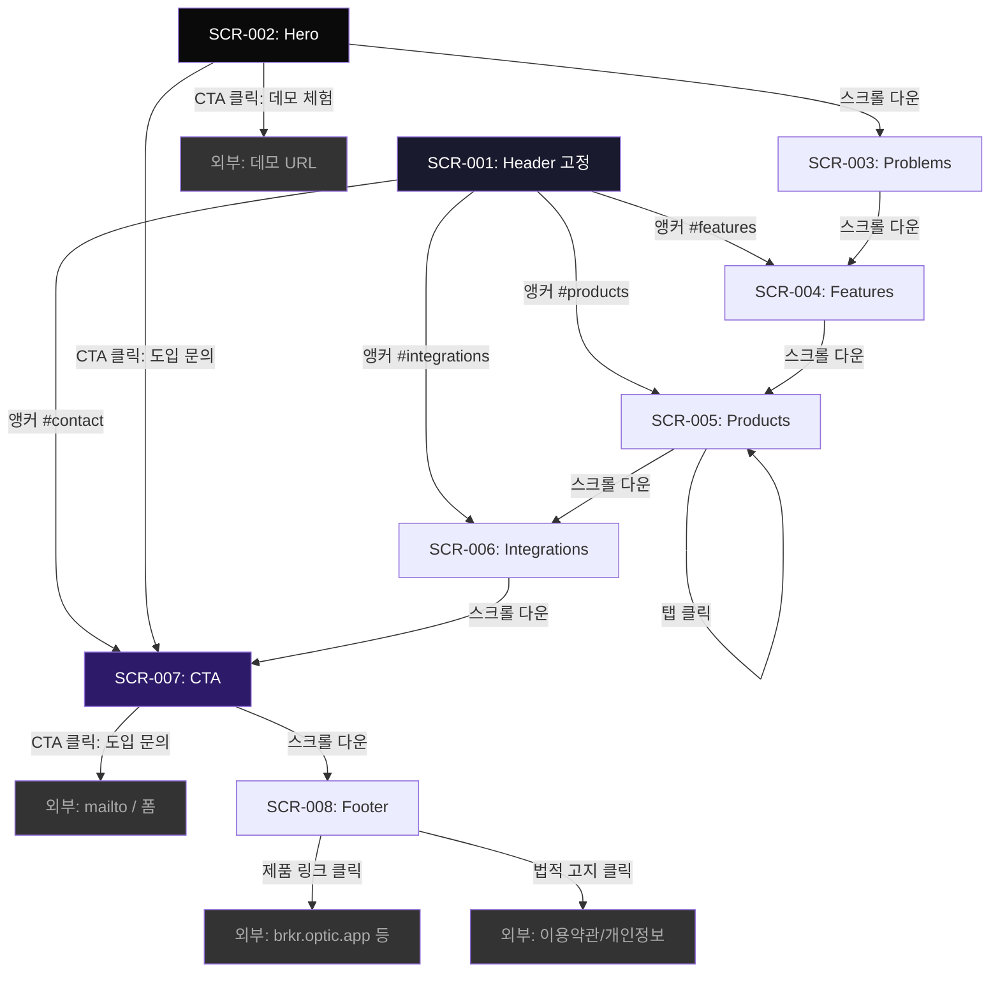

# OPTIC 랜딩 페이지 — 네비게이션 플로우

> 단일 페이지 스크롤 기반 네비게이션. 화면 전환 없음.

---

## 스크롤 네비게이션 플로우

## 인터랙션 상세

### Header 앵커 링크

| 링크 텍스트 | 대상 섹션 | 동작 |
|-------------|----------|------|
| 기능 | SCR-004: Features | smooth scroll to `#features` |
| 제품 | SCR-005: Products | smooth scroll to `#products` |
| 연동 | SCR-006: Integrations | smooth scroll to `#integrations` |
| 도입 문의하기 | SCR-007: CTA | smooth scroll to `#contact` |

### CTA 버튼

| 위치 | 버튼 텍스트 | 동작 |
|------|-----------|------|
| SCR-002 Hero | 도입 문의하기 | scroll to `#contact` |
| SCR-002 Hero | 데모 체험하기 | 외부 링크 (새 탭) |
| SCR-007 CTA | 도입 문의하기 | mailto: 또는 외부 폼 (새 탭) |

### Header 스크롤 동작

| 상태 | 조건 | 스타일 |
|------|------|--------|
| 투명 | scrollY < 100px | background: transparent |
| 블러 | scrollY >= 100px | background: rgba(10,10,10,0.8) + backdrop-blur(12px) |

### Products 탭 인터랙션

| 동작 | 결과 |
|------|------|
| 탭 클릭 (Desktop) | 해당 제품 콘텐츠로 전환 (애니메이션) |
| 스와이프 (Mobile) | 탭 가로 스크롤 + 콘텐츠 전환 |

## 외부 링크

| 대상 | URL 패턴 | 열기 방식 |
|------|----------|----------|
| 데모 체험 | TBD (별도 결정) | 새 탭 |
| 도입 문의 | mailto:contact@optic.app 또는 외부 폼 | 새 탭 |
| Broker 앱 | brkr.optic.app | 새 탭 |
| Shipper 앱 | shpr.optic.app | 새 탭 |
| 이용약관 | TBD | 새 탭 |
| 개인정보처리방침 | TBD | 새 탭 |
