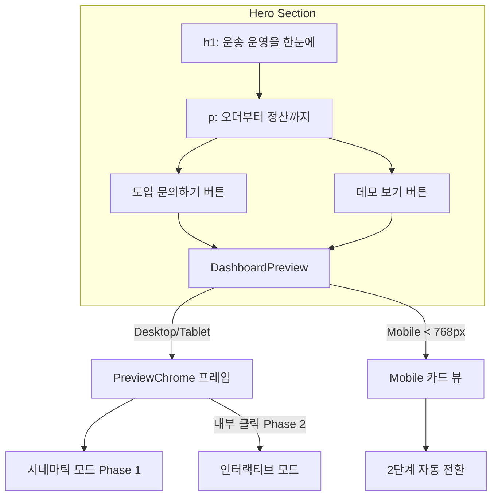
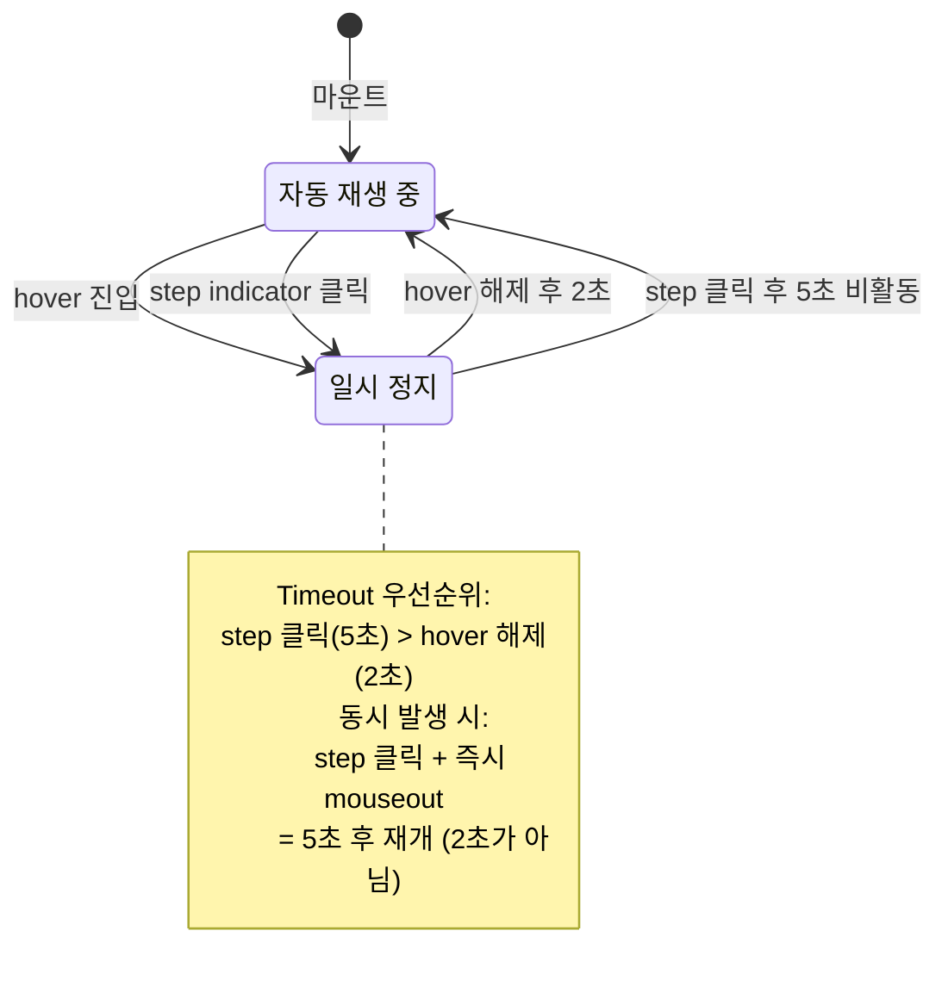
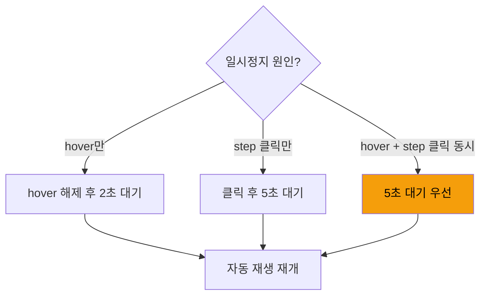
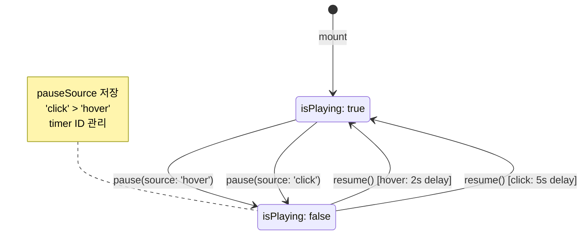
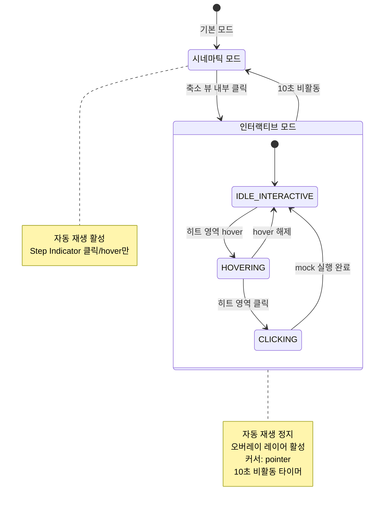
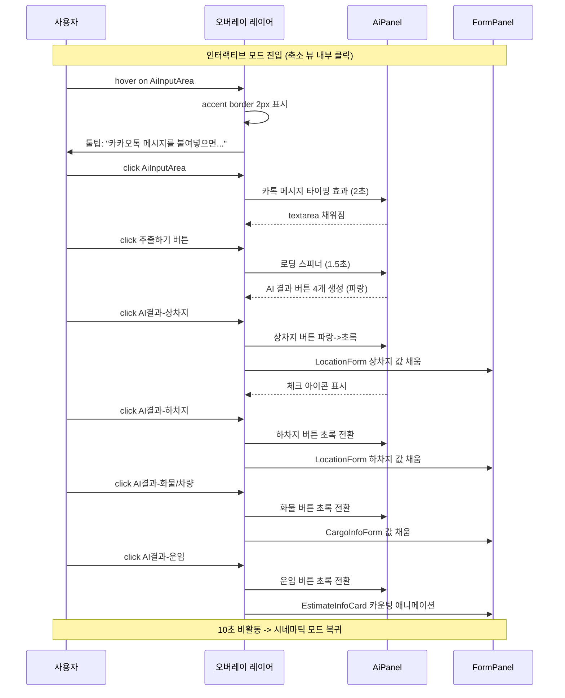
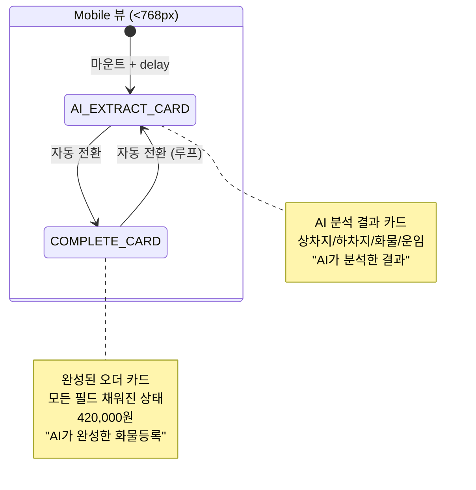
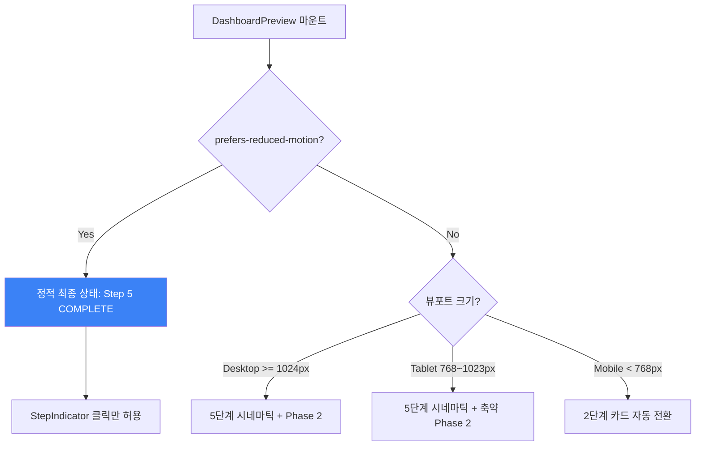

# Navigation & State Flow: Dashboard Preview

> **PRD**: `dash-preview` (Approved 2026-04-14)
> **Last Updated**: 2026-04-14

---

## 1. 전체 네비게이션 플로우



---

## 2. Phase 1 상태 머신: 시네마틱 자동 재생

```mermaid
stateDiagram-v2
    [*] --> INITIAL : 마운트 + delay 0.6s

    INITIAL --> AI_INPUT : 3초 경과
    AI_INPUT --> AI_EXTRACT : 4초 경과
    AI_EXTRACT --> AI_APPLY : 4초 경과
    AI_APPLY --> COMPLETE : 4초 경과
    COMPLETE --> INITIAL : 3초 경과 (루프)

    state "Step 1: INITIAL" as INITIAL {
        note right of INITIAL
            빈 폼 + AiPanel 열림
            textarea 비어있음
            추출하기 disabled
        end note
    }

    state "Step 2: AI_INPUT" as AI_INPUT {
        note right of AI_INPUT
            카톡 메시지 타이핑
            추출하기 활성화
        end note
    }

    state "Step 3: AI_EXTRACT" as AI_EXTRACT {
        note right of AI_EXTRACT
            로딩 스피너
            4개 카테고리 버튼 생성 (파랑)
        end note
    }

    state "Step 4: AI_APPLY" as AI_APPLY {
        note right of AI_APPLY
            버튼 순차 초록 전환
            폼 필드 자동 채움
            금액 카운팅
        end note
    }

    state "Step 5: COMPLETE" as COMPLETE {
        note right of COMPLETE
            모든 버튼 초록
            모든 필드 채워짐
            420,000원 표시
        end note
    }
```

### 타이밍 상세

| Step | ID | Duration | 누적 시간 | 내부 애니메이션 |
|------|-----|---------|----------|----------------|
| 1 | INITIAL | 3s | 0~3s | 없음 (정적) |
| 2 | AI_INPUT | 4s | 3~7s | 타이핑 효과 (글자 단위) |
| 3 | AI_EXTRACT | 4s | 7~11s | 0~1s: 버튼 클릭 효과 + 스피너, 1~4s: 버튼 stagger 등장 |
| 4 | AI_APPLY | 4s | 11~15s | 0.5s 간격 stagger: 상차지->하차지->화물->운임 |
| 5 | COMPLETE | 3s | 15~18s | settled 상태, 미묘한 완료 강조 |
| (루프) | -> INITIAL | - | 18s~ | cross-fade 전환 |

**전체 루프**: 18초 (범위: 16~22초, REQ-DASH-011)

---

## 3. Phase 1 인터랙션 상태: Hover/Click



### Timeout 우선순위 규칙 (REQ-DASH-019)



### useAutoPlay 훅 상태 다이어그램



---

## 4. Phase 2 모드 전환 플로우



### Phase 2 인터랙션 시퀀스



---

## 5. Mobile 전용 상태 플로우



### Mobile 2단계 타이밍

| Step | 카드 | Duration | 설명 |
|------|------|---------|------|
| A | AI_EXTRACT | 4s | AI가 분석한 4개 카테고리 결과 표시 |
| B | COMPLETE | 4s | 완성된 폼 데이터 카드 |
| 전환 | cross-fade | 0.3s | opacity 전환. Desktop(0.4s)보다 짧은 이유: 모바일 카드 뷰는 콘텐츠가 단순하여 빠른 전환이 자연스러움 |

---

## 6. 접근성 상태 분기



---

## 7. 전체 상태 요약 매트릭스

| 상태 | isPlaying | mode | currentStep | 트리거 |
|------|-----------|------|-------------|--------|
| 자동 재생 중 | true | cinematic | 0~4 순환 | 마운트, timeout 완료 |
| hover 일시정지 | false | cinematic | 현재 유지 | Preview hover |
| step 클릭 일시정지 | false | cinematic | 클릭한 step | StepIndicator 클릭 |
| 인터랙티브 활성 | false | interactive | 현재 유지 | 축소 뷰 내부 클릭 |
| 인터랙티브 hover | false | interactive | 현재 유지 | 히트 영역 hover |
| 인터랙티브 클릭 | false | interactive | 현재 유지 | 히트 영역 클릭 |
| reduced-motion 정적 | false | static | 4 (COMPLETE) | prefers-reduced-motion |
| Mobile 자동 전환 | true | mobile | A/B 순환 | Mobile 뷰 마운트 |

---

## 8. 이벤트-상태 전환 표

| 이벤트 | 현재 상태 | 다음 상태 | 조건 | REQ |
|--------|----------|----------|------|-----|
| timer tick | PLAYING(step N) | PLAYING(step N+1) | duration 경과 | REQ-DASH-010~012 |
| timer tick | PLAYING(step 4) | PLAYING(step 0) | 루프 | REQ-DASH-012 |
| mouseenter | PLAYING | PAUSED(hover) | - | REQ-DASH-017 |
| mouseleave | PAUSED(hover) | PLAYING | 2초 후 | REQ-DASH-018 |
| step click | PLAYING/PAUSED | PAUSED(click, step=N) | - | REQ-DASH-015~016 |
| idle 5s | PAUSED(click) | PLAYING | 비활동 | REQ-DASH-016 |
| click + mouseout | PAUSED(click) | PLAYING | 5초 후 (우선) | REQ-DASH-019 |
| inner click | CINEMATIC | INTERACTIVE | Desktop/Tablet만 | REQ-DASH-034 |
| idle 10s | INTERACTIVE | CINEMATIC | 비활동 | REQ-DASH-035 |
| hit hover | INTERACTIVE | INTERACTIVE(hover) | - | REQ-DASH-036~038 |
| hit click | INTERACTIVE | INTERACTIVE(action) | mock 실행 | REQ-DASH-039~041 |
