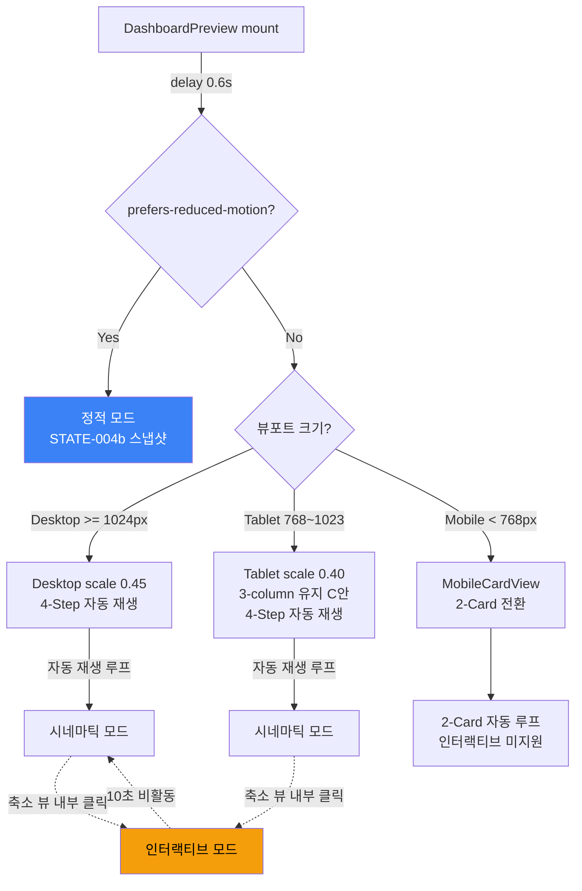
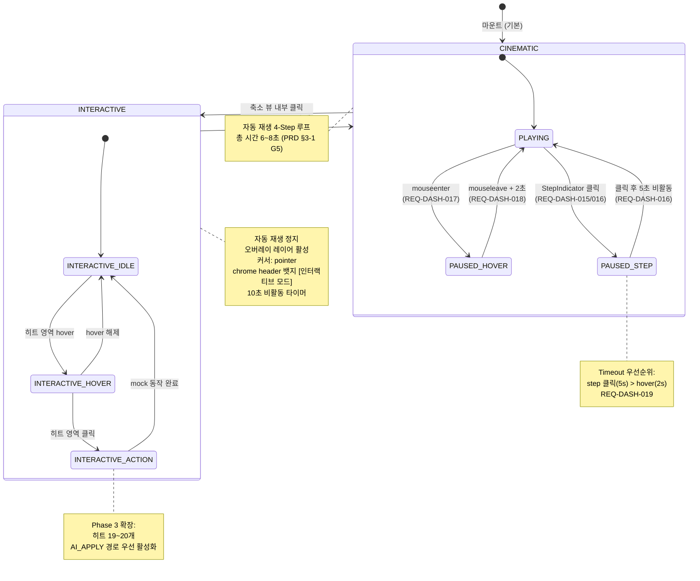
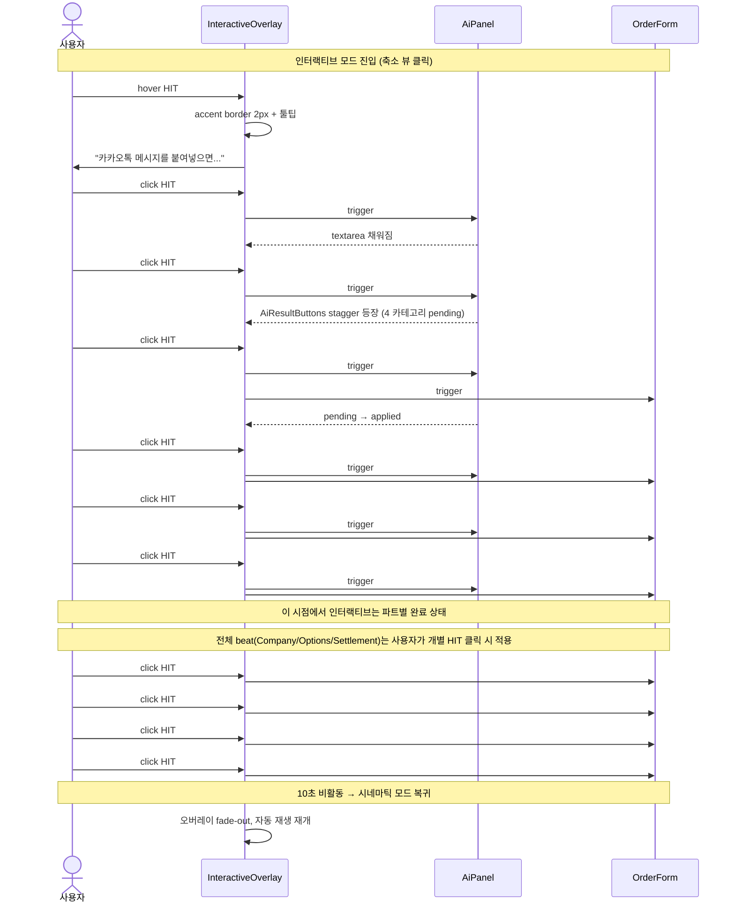
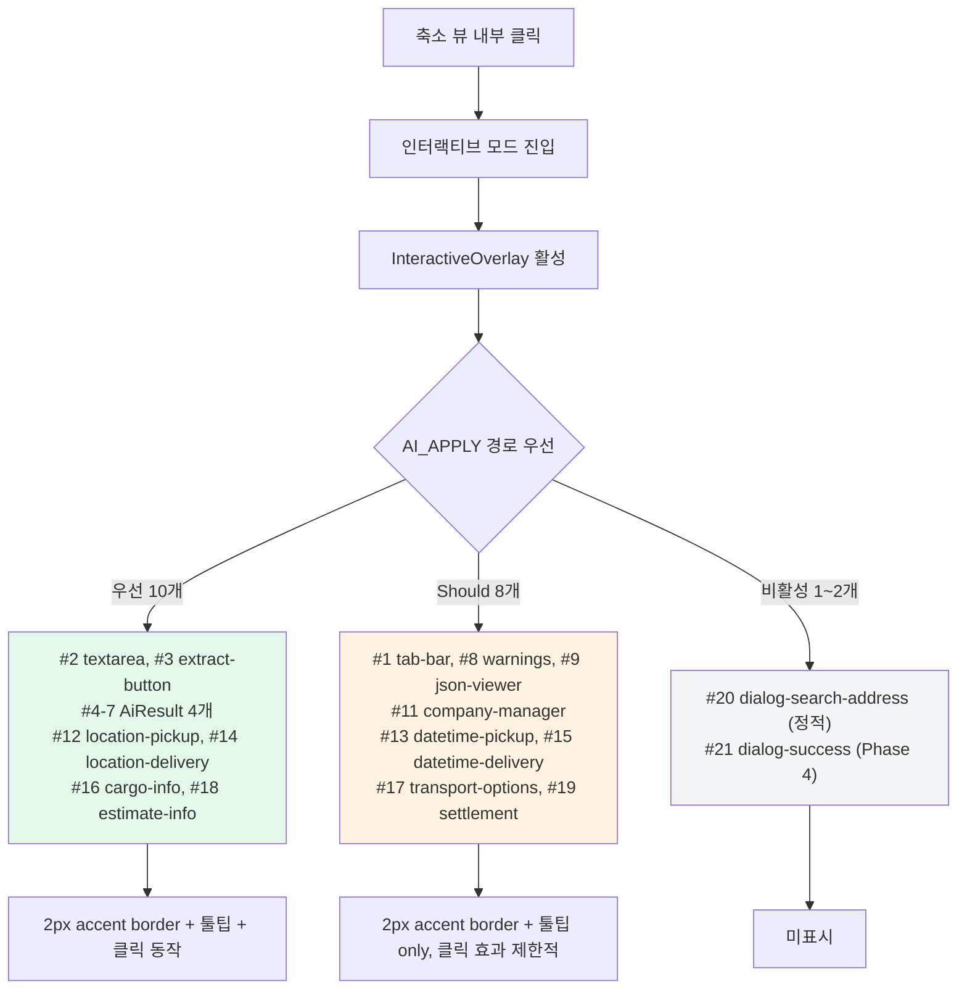
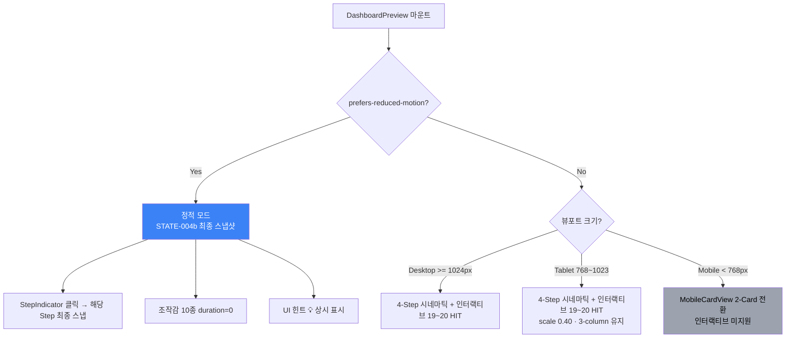
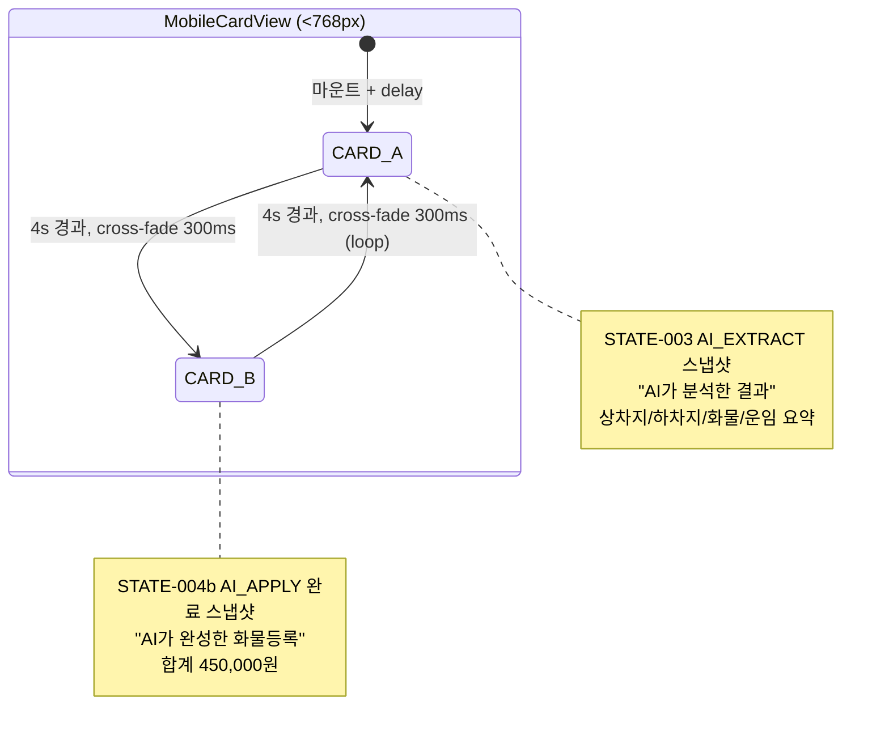

# Navigation & State Flow: dash-preview Phase 3

> **PRD**: [`01-prd-freeze.md`](../../00-context/01-prd-freeze.md)
> **Phase 1 스펙**: [`IMP-DASH-001-option-b-spec-phase1.md`](../../../../../archive/dash-preview/improvements/IMP-DASH-001-option-b-spec-phase1.md)
> **Last Updated**: 2026-04-17
> **Authored by**: plan-wireframe-designer

---

## 0. 이 문서가 다루는 것

Phase 3의 "네비게이션"은 일반적 page-to-page 이동이 아니다. 본 wireframe의 네비게이션은 다음 3가지 상태 흐름을 다룬다:

1. **§2 Step 전환 플로우** — 4단계 + AI_APPLY 2단 내부 타임라인, 오버랩 100~200ms 포함
2. **§3 조작감 레이어 발생 타임라인** — Step 내 10종 조작감의 발생 순서 + duration
3. **§4 인터랙티브 모드 상태 다이어그램** — hover pause, click enter, 10s idle auto-resume (Phase 2 승계)

---

## 1. 전체 모드 맵



---

## 2. Step 전환 플로우 (자동 재생, 4단계 + AI_APPLY 2단)

### 2-1. 상태 다이어그램 (오버랩 명시)

```mermaid
stateDiagram-v2
    [*] --> INITIAL : mount + delay 0.6s

    INITIAL --> AI_INPUT : 500ms 경과<br/>(overlap 100~200ms)
    AI_INPUT --> AI_EXTRACT : 1500~2000ms 경과<br/>(overlap 100~200ms)
    AI_EXTRACT --> AI_APPLY_PARTIAL : 800~1000ms 경과<br/>(overlap 100~200ms)
    AI_APPLY_PARTIAL --> AI_APPLY_ALL : 1200~1500ms 경과<br/>(INTERNAL boundary, 오버랩 없음)
    AI_APPLY_ALL --> HOLD : 500~800ms 경과
    HOLD --> INITIAL : 500ms hold (loop)<br/>(overlap 100~200ms)

    state "STATE-001: INITIAL" as INITIAL {
        note right of INITIAL
            빈 폼, caret 대기
            추출 버튼 disabled
            지속 ~= 500ms
        end note
    }

    state "STATE-002: AI_INPUT" as AI_INPUT {
        note right of AI_INPUT
            #1 fake-typing (변동 리듬)
            #2 focus-walk (Should)
            textarea 글자 스트림
            지속 1.5~2.0s
        end note
    }

    state "STATE-003: AI_EXTRACT" as AI_EXTRACT {
        note right of AI_EXTRACT
            #3 button-press (150ms)
            spinner (<=400ms)
            AiResultButtons stagger 등장
            지속 0.8~1.0s
        end note
    }

    state "STATE-004a: AI_APPLY / partial" as AI_APPLY_PARTIAL {
        note right of AI_APPLY_PARTIAL
            4 카테고리 순차 press+ripple
            #3 + #4 + #6 fill-in
            간격 150~250ms
            #7 dropdown, #8 운임 롤링
            지속 1.2~1.5s
        end note
    }

    state "STATE-004b: AI_APPLY / all" as AI_APPLY_ALL {
        note right of AI_APPLY_ALL
            Company + Options + Settlement
            #6 fill-in 간격 80~120ms
            #9 toggle stroke (200ms)
            #8 number-rolling 합계
            지속 0.5~0.8s
        end note
    }

    state "HOLD" as HOLD {
        note right of HOLD
            최종 상태 유지
            다음 loop으로 오버랩 준비
            지속 500ms
        end note
    }
```

### 2-2. 타이밍 총합 (연속 재생 기준)

| Step | 지속 | 누적 시작 | 누적 종료 | 다음 Step과 오버랩 |
|------|------|----------|----------|-------------------|
| STATE-001 INITIAL | 500ms | 0ms | 500ms | 100~200ms |
| STATE-002 AI_INPUT | 1500~2000ms | 300~400ms | 1800~2400ms | 100~200ms |
| STATE-003 AI_EXTRACT | 800~1000ms | 1600~2300ms | 2400~3300ms | 100~200ms |
| STATE-004a AI_APPLY partial | 1200~1500ms | 2200~3200ms | 3400~4700ms | 0 (internal) |
| STATE-004b AI_APPLY all | 500~800ms | 3400~4700ms | 3900~5500ms | — |
| HOLD | 500ms | 3900~5500ms | 4400~6000ms | 100~200ms (→ INITIAL) |

**총 루프 시간: 4.4 ~ 6.0s** (선형 합 6.5~8.3s에서 오버랩 분량 차감).

**PRD REQ-DASH3-063 목표치 6~8s 범위 내 수렴** ✓.

### 2-3. 오버랩 상세 시각화

```
시간 축 (ms) →
     0         500        2000        3000        4500        5500
     |          |           |           |           |           |

INITIAL  [████████▒▒]
                 └ 오버랩 100~200ms
AI_INPUT        [████▒▒▒▒▒▒▒▒▒▒▒▒]
                                 └ 오버랩 100~200ms
AI_EXTRACT                      [████████▒▒]
                                           └ 오버랩 100~200ms
AI_APPLY partial                         [████████████▒]
                                                       └ 내부 경계 (오버랩 없음)
AI_APPLY all                                        [█████]
                                                         └ hold
HOLD                                                    [████]
                                                             └ 오버랩 100~200ms → INITIAL (loop)

█ = 활성 구간
▒ = 오버랩 구간 (다음 Step이 이미 시작됨)
```

**핵심 원칙** (PRD §2-3):
- **"앞 Step의 마지막 조작감이 사라지기 전에 다음 Step의 첫 동작이 시작"**
- cross-fade (opacity 공동 하락 후 상승) 폐기 — "스크린샷 넘김" 인상 유발
- 오버랩 대신 사용: 앞 Step의 UI는 유지된 채 다음 Step의 새 요소 등장 (예: INITIAL의 caret blink가 유지되는 동안 AI_INPUT의 첫 글자 push-in)

### 2-4. AI_APPLY 내부 2단 구조 (안 B 확정) + 3-column 이동 경로

```mermaid
flowchart LR
    ENTER[STATE-004a 진입] --> PART1["partial-beat T=0<br/>📍 상차지<br/>press+ripple+fill-in<br/><b>Col 1 row 2</b>"]
    PART1 -->|150~250ms| PART2["partial-beat T=200<br/>🚩 하차지<br/>press+ripple+fill-in<br/><b>Col 1 row 3 + Col 2 row 2</b>"]
    PART2 -->|150~250ms| PART3["partial-beat T=400<br/>📦 화물<br/>press+ripple+fill-in+dropdown<br/><b>Col 2 row 3</b>"]
    PART3 -->|150~250ms| PART4["partial-beat T=600<br/>💰 운임<br/>press+ripple+#8 rolling<br/><b>Col 3 row 2 일부</b>"]
    PART4 -->|internal boundary 0ms overlap| ALL1["all-beat T=0<br/>TransportOption 8옵션 #9 stroke<br/>stagger 60ms<br/><b>Col 3 row 1</b>"]
    ALL1 -->|80~120ms| ALL2["all-beat T=150<br/>자동배차 #9 stroke<br/><b>Col 3 row 2</b>"]
    ALL2 -->|80~120ms| ALL3["all-beat T=200<br/>Settlement 청구/지급 #8 롤링<br/><b>Col 3 row 3</b>"]
    ALL3 -->|80~120ms| ALL4["all-beat T=300<br/>Settlement 추가 요금 +30k #8<br/><b>Col 3 row 3</b>"]
    ALL4 -->|80~120ms| ALL5["all-beat T=400<br/>Settlement 합계 #8 최종 롤링<br/><b>Col 3 row 3</b>"]
    ALL5 --> EXIT[STATE-004b 완료 → HOLD]

    style PART1 fill:#22c55e20
    style PART2 fill:#22c55e20
    style PART3 fill:#22c55e20
    style PART4 fill:#22c55e20
    style ALL1 fill:#3b82f620
    style ALL2 fill:#3b82f620
    style ALL3 fill:#3b82f620
    style ALL4 fill:#3b82f620
    style ALL5 fill:#3b82f620
```



**전체 beat 구성 재조정 (REQ-DASH3-014, decision-log §4-4):**
- **제거**: Company #6 fill-in 노드 (pre-filled 옵틱물류/이매니저로 대체 → AI_APPLY 영향 없음)
- **확장**: TransportOption 3옵션 → **8옵션 전체** stroke (stagger 60ms로 균일화)
- **신규**: Settlement 추가 요금 +30k 별도 롤링 노드
- **불변**: 내부 경계 overlap 0ms, 각 노드 간 간격 80~120ms, 전체 beat 총 지속 ≤ 0.8s

**Partial → All 경계**: 내부 타임라인 분할 방식(안 B)이므로 Step 전환 오버랩 규칙 **비적용**. 단, 마지막 partial(💰 운임)의 ripple 꼬리가 all 첫 트리거(**TransportOption 8옵션 stroke**)와 **자연스럽게 이어지도록** interactions 타이밍 트랙에서 offset 조정. Company fill-in은 pre-filled로 인해 노드 자체가 없음 (REQ-DASH3-014).

**3-column 이동 경로 대각 흐름 (REQ-DASH-003/007 반영):**

| 단계 | Time | AiPanel 카테고리 | OrderForm Column | 흐름 방향 |
|------|------|-------------------|------------------|-----------|
| Partial 1 | T=0 | 📍 상차지 | Col 1 row 2 | 시작 |
| Partial 2 | T=200 | 🚩 하차지 | Col 1 row 3 + Col 2 row 2 | Col 1 유지 + Col 2 개입 |
| Partial 3 | T=400 | 📦 화물 | Col 2 row 3 | Col 2 완결 |
| Partial 4 | T=600 | 💰 운임 | Col 3 row 2 일부 | Col 3 진입 |
| All 1 | T=800 | (TransportOption 8옵션 자동) | Col 3 row 1 | **Col 3 내부 유지** (Company 제거 — pre-filled) |
| All 2 | T=950 | (자동배차 자동) | Col 3 row 2 | Col 3 하단 |
| All 3 | T=1000 | (Settlement 청구/지급 자동) | Col 3 row 3 | Col 3 최하단 |
| All 4 | T=1100 | (Settlement 추가 요금 자동) | Col 3 row 3 | Col 3 최하단 (추가 요금) |
| All 5 | T=1200 | (합계 자동) | Col 3 row 3 | Col 3 최하단 (합계 확정) |

**흐름 요약 (REQ-DASH3-014 반영):**
- 파트별 beat는 **Col 1 → Col 2 → Col 3**으로 왼→오 대각 흐름 (자연스러운 읽기 순서).
- 전체 beat는 **Col 3에 시선 고정** (Col 1 Company는 pre-filled "옵틱물류"이므로 되감기 없음). 합계 450,000원으로 마감.
- **시선 이동 패턴 간소화**: 기존 Col 3→Col 1(되감기)→Col 3 경로 제거. 파트별 beat 마지막 운임(Col 3)에서 전체 beat Transport(Col 3)으로 **자연스러운 연속 흐름**. UX 혼란 감소.
- **Column-wise Border Pulse (#10)**: 각 Column 전환 시 활성 섹션에 400ms glow → 시선 유도. 원본 구조의 "업무 흐름 순서"를 시각화. **전체 beat Col 1 pulse 제거**됨.

---

## 3. 조작감 레이어 발생 타임라인 (10종)

### 3-1. Step별 조작감 발생 순서 (Desktop 기준, Column 주석 포함)

```mermaid
gantt
    title 조작감 레이어 10종 발생 타임라인 (단일 루프, 0~6000ms, Column 표기)
    dateFormat x
    axisFormat %Lms

    section STATE-001 INITIAL
    (없음 — 정적 caret)   :done, initial, 0, 500

    section STATE-002 AI_INPUT
    #1 fake-typing (변동 리듬, AiInputArea)  :active, fake, 400, 1800
    #2 focus-walk (AiInputArea → ExtractButton) :active, focus, 1600, 1900

    section STATE-003 AI_EXTRACT
    #3 button-press (ExtractButton, 150ms)    :active, press, 1900, 2050
    spinner (ExtractButton, 400ms)            :spin, 2050, 2450
    AiResultButtons stagger 등장 (4 cards)    :cards, 2100, 2700

    section STATE-004a AI_APPLY partial
    📍 상차지 press+ripple [Col1 row2]          :active, p1, 2700, 3000
    #6 fill-in 상차지 LocationForm [Col1 row2]  :fill1, 2750, 3300
    🚩 하차지 press+ripple [Col1 row3 + Col2 row2] :active, p2, 2900, 3200
    #6 fill-in 하차지 + DateTime [Col1 row3, Col2 row2] :fill2, 2950, 3400
    📦 화물 press+ripple+dropdown [Col2 row3]   :active, p3, 3100, 3500
    #6 fill-in CargoInfoForm [Col2 row3]        :fill3, 3150, 3500
    💰 운임 press+ripple [Col3 row2]            :active, p4, 3300, 3600
    #8 number-rolling 거리/운임 [Col3 row2]     :num1, 3350, 3800

    section STATE-004b AI_APPLY all
    #9 toggle stroke Transport 8옵션 [Col3 row1] :active, all1, 3800, 4220
    #9 toggle stroke 자동배차 [Col3 row2]        :active, all2, 3950, 4150
    #8 number-rolling 청구/지급 [Col3 row3]      :active, all3, 4000, 4400
    #8 number-rolling 추가 요금 +30k [Col3 row3] :active, all4, 4100, 4400
    #8 number-rolling 합계 최종 [Col3 row3]      :active, all5, 4200, 4500

    section HOLD
    (최종 상태 유지)        :done, hold, 4500, 5000

    section Reserved
    #5 hover→active (CSS only) :crit, hover, 0, 6000
    #10 Column-wise Border Pulse (OrderForm 활성 섹션) :crit, colpulse, 2700, 4500
    (CompanyManager pre-filled 옵틱물류/이매니저, 전 Step 유지) :crit, precomp, 0, 6000
```



**Column 이동 타임라인 시각화** (Gantt 보완, REQ-DASH3-014 반영):

```
시간 축 (ms) →
     2700      3000      3400      3800      4200      4500
     |          |          |          |          |          |

Col 1  [상차 fill][하차 fill]............................................
       ▸ pulse ▸ pulse
       (Company 옵틱물류/이매니저 = pre-filled, 조작감 없음, 전 Step 유지)

Col 2  .........[하차 DT ][화물 fill]............................................
                ▸ pulse   ▸ pulse

Col 3  ........................[운임]..[8옵션][자동배차][Settlement 청구/지급/추가/합계]
                               ▸ pulse  ▸ pulse ▸ pulse  ▸ pulse

▸ pulse = #10 Column-wise Border Pulse 400ms (outline+box-shadow)

주요 변경 (2026-04-17 옵틱물류 반영):
- Col 1 전체 beat pulse 제거 (Company pre-filled)
- Col 3 TransportOption 3옵션 → 8옵션 stroke stagger (total 420ms)
- Settlement 추가 요금 +30k 단계 신규 편입
```

### 3-2. 조작감 레이어별 정적 속성 표

| # | 이름 | 컴포넌트 | Step | Duration | Priority | 유틸 |
|---|------|---------|------|---------|----------|------|
| 1 | fake-typing | AiInputArea | AI_INPUT | **≤ 1.5s** | **Must (MVP)** | `use-fake-typing.ts` |
| 2 | focus-walk | AiInputArea → ExtractButton → Results | Step 전환 | 300ms | Should | `use-focus-walk.ts` |
| 3 | button-press | AiExtractButton, AiButtonItem | AI_EXTRACT, AI_APPLY | **150ms** | **Must (MVP)** | `use-button-press.ts` |
| 4 | ripple | AiButtonItem | AI_APPLY | **300ms** | Should | `use-ripple.ts` |
| 5 | hover→active | AiResultButtons | AI_APPLY 직전 | CSS transition 200ms | Should | CSS only |
| 6 | fill-in caret | Location/Cargo/DateTime/Company 필드 | AI_APPLY | caret blink **150~200ms** + 값 즉시 등장, 필드 간 간격 **≤ 120ms** | **Must (MVP)** | `use-fill-in-caret.ts` |
| 7 | dropdown 펼침 | CargoInfoForm select | AI_APPLY 파트별 (화물) | 3-beat (열림-하이라이트-닫힘) ≤ 600ms | Should | 전용 prop |
| 8 | number-rolling | EstimateInfoCard, SettlementSection | AI_APPLY | **0.3~0.5s** | **Must (MVP)** | `use-number-rolling.ts` |
| 9 | toggle stroke | TransportOptionCard 8옵션, 자동배차 | AI_APPLY 전체 beat | **200ms** | Should | CSS + SVG stroke-dashoffset |
| 10 | **Column-wise Border Pulse** (재정의) | OrderForm 3-column grid 내 활성 섹션 | AI_APPLY 파트별/전체 beat | **400ms** (outline 2px + box-shadow glow) | Should | CSS `@keyframes pulse` + columnPulseTargets prop |

### 3-3. 동시 발생 상한 규칙 (R14 대응)

동시 실행되는 조작감은 컴포넌트별 **최대 2종**으로 제한한다.

| 컴포넌트 | Step | 동시 실행 조작감 | 검증 |
|---------|------|-----------------|------|
| AiExtractButton | AI_EXTRACT | #3 press + spinner | OK (시각 영역 다름) |
| AiButtonItem | AI_APPLY partial | #3 press + #4 ripple | OK (#4 offset 50ms로 분리) |
| CargoInfoForm select | AI_APPLY 화물 | #6 fill-in + #7 dropdown | OK (fill-in은 input, dropdown은 select) |
| OrderForm 섹션 전체 | AI_APPLY 동안 | **#10 Column-wise Border Pulse + #6 fill-in (동일 섹션)** | OK — pulse는 outline/box-shadow 레이어, fill-in은 input 내부. 시각 영역 분리. 동시 실행 허용 (오히려 "현재 채워지는 섹션을 강조" 효과로 시너지) |
| OrderForm Column 간 | AI_APPLY 동안 | **#10 pulse 동시 2개 Column 활성 허용** | 파트별 T=200 (Col 1 하차 + Col 2 DateTime 동반) 같이 2 Column 동시 pulse — "동시 작업" 체감 효과. 3 Column 동시는 금지. |

---

## 4. 인터랙티브 모드 상태 머신 (Phase 2 승계 + Phase 3 확장)

### 4-1. 시네마틱 ↔ 인터랙티브 모드 전환



### 4-2. Phase 3 인터랙티브 시퀀스 (AI_APPLY 경로 우선)



### 4-3. 히트 영역 활성화 우선순위 (REQ-DASH3-037 확장)



---

## 5. 접근성 상태 분기



---

## 6. 이벤트-상태 전환 표 (REQ 대조)

| 이벤트 | 현재 상태 | 다음 상태 | 조건 | REQ |
|--------|----------|----------|------|-----|
| timer tick | PLAYING(N) | PLAYING(N+1) | duration + overlap 경과 | REQ-DASH-010~013, REQ-DASH3-063 |
| timer tick | PLAYING(STATE-004b) | PLAYING(HOLD) | duration 경과 | REQ-DASH3-011 |
| timer tick | PLAYING(HOLD) | PLAYING(STATE-001) | 500ms + overlap | REQ-DASH3-011, REQ-DASH-013 |
| mouseenter | PLAYING | PAUSED(hover) | - | REQ-DASH-017 |
| mouseleave | PAUSED(hover) | PLAYING | 2초 후 | REQ-DASH-018 |
| step click | PLAYING/PAUSED | PAUSED(click, N) | - | REQ-DASH-015/016 |
| idle 5s | PAUSED(click) | PLAYING | - | REQ-DASH-016 |
| click+mouseout | PAUSED(click) | PLAYING | 5초 후 우선 | REQ-DASH-019 |
| 축소 뷰 inner click | CINEMATIC | INTERACTIVE | Desktop/Tablet | REQ-DASH-034 |
| idle 10s | INTERACTIVE | CINEMATIC | - | REQ-DASH-035 |
| hit hover | INTERACTIVE | INTERACTIVE(hover) | - | REQ-DASH-036~038 |
| hit click | INTERACTIVE | INTERACTIVE(action) | mock 실행 | REQ-DASH-039~041 |
| prefers-reduced-motion | MOUNT | STATIC | OS 설정 감지 | REQ-DASH3-031 |
| AI_APPLY 진입 | STATE-003 | STATE-004a | 800~1000ms 경과 | REQ-DASH3-040~042 |
| partial → all | STATE-004a | STATE-004b | 1200~1500ms 내부 타임라인 | REQ-DASH3-041 (안 B) |

---

## 7. Mobile 전용 상태 플로우 (불변, 승계)



**Mobile 주의사항:**
- **Step 전환 오버랩 규칙 비적용** — 카드 콘텐츠 형상 차이로 cross-fade 300ms 유지.
- **조작감 레이어 10종 미적용** (PRD §3-2 Non-Goals).
- **인터랙티브 모드 미지원** (REQ-DASH-045 승계).
- **prefers-reduced-motion**: Card B 정적 표시.

---

## 8. 변경 이력

| 날짜 | 내용 |
|------|------|
| 2026-04-17 | 초안 — Step 4-단계 + AI_APPLY 2단 확장, 오버랩 타임라인, 조작감 Gantt, 인터랙티브 모드 확장 (HIT 19~20) |
| 2026-04-17 | **OrderForm 3-column Column 이동 경로 주입** — §2-4 Mermaid flowchart의 각 beat 노드에 `<b>Col N row M</b>` 표기 추가. §2-4 하단에 "3-column 이동 경로 대각 흐름" 표 신규. §3-1 Gantt 각 AI_APPLY 라벨에 `[Col N row M]` 주석 추가. §3-1 하단 "Column 이동 타임라인 시각화" ASCII 보조 도식 신규. §3-2 #10 Column-wise Border Pulse로 재정의 (scrollIntoView 400ms + pulse 500ms → outline+box-shadow 400ms). §3-3 #10 동시 실행 규칙 업데이트 (동일 섹션 #6+#10 허용, Column간 2 Column 동시 pulse 허용). |
| 2026-04-17 | **가상 화주 "옵틱물류" pre-filled 반영** — §2-4 Mermaid flowchart 전체 beat 노드에서 "Company #6 fill-in" 제거, TransportOption 3옵션 → **8옵션 stagger 60ms** 확장, Settlement 단계 세분화(청구/지급 → 추가 요금 +30k → 합계), 내부 타이밍 T=800~1200으로 단축. §2-4 하단 표의 All 1~5 행 재작성(Col 1 되감기 제거, Col 3 내부 유지). §3-1 Gantt `section STATE-004b`의 5개 라벨 전면 재작성 (CompanyManager → TransportOption 8옵션 / 자동배차 / Settlement 청구·지급 / 추가 요금 / 합계), `precomp` Reserved 섹션 신규(pre-filled 상시 유지). §3-1 하단 Column 이동 타임라인 ASCII: Col 1 전체 beat pulse 제거 + 주요 변경 3건 주석 추가. 변경 근거: decision-log §4. |
