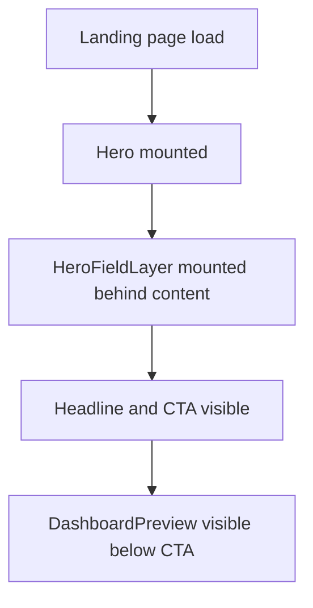
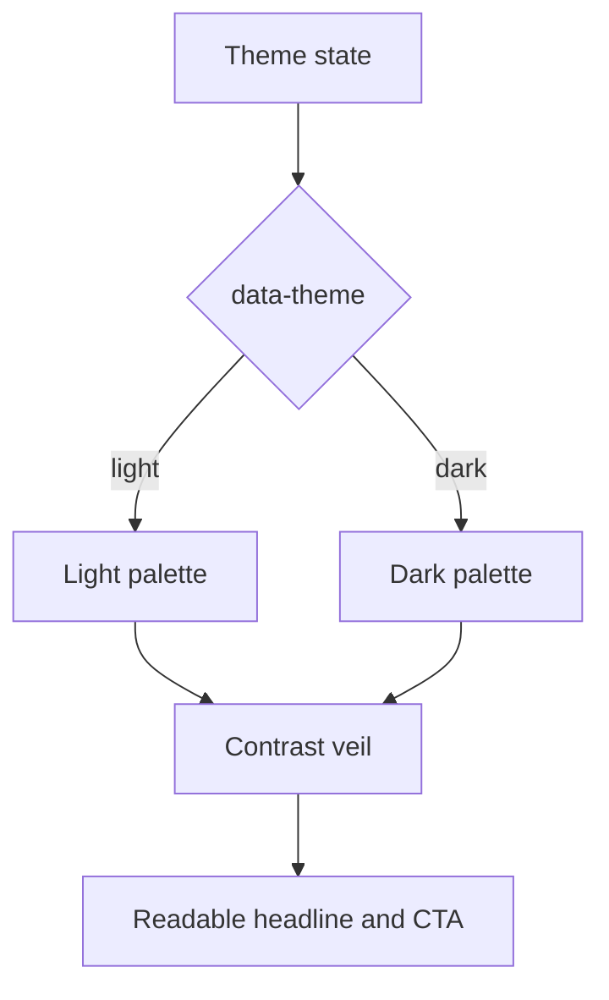
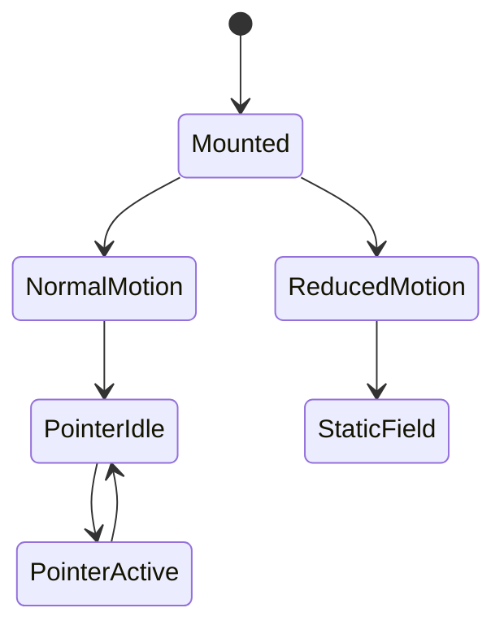

# Flow: hero-01-reference-hero-refresh

> **Feature**: hero-01 레퍼런스 기반 Hero 섹션 재개선
> **Navigation Source**: `../../../../wireframes/hero-01-reference-hero-refresh/navigation.md`
> **Created**: 2026-04-28

---

## 0. 이 문서의 역할

이 문서는 Hero의 상태 흐름을 구현자가 놓치지 않도록 정리한다. 새 page route는 만들지 않는다.

---

## 1. Page Load Flow



Acceptance:

- field mount 때문에 layout shift가 생기면 안 된다.
- `HeroFieldLayer`는 decorative layer로 처리한다.
- content z-index가 background보다 높아야 한다.

---

## 2. Theme Flow



Acceptance:

- theme switch 후 palette와 veil이 함께 맞아야 한다.
- light mode에서 text가 washed-out 되면 안 된다.
- dark mode가 violet/blue 한 톤으로만 보이면 안 된다.

---

## 3. Pointer and Motion Flow



Acceptance:

- desktop normal motion에서만 subtle pointer highlight를 허용한다.
- coarse pointer와 mobile에서는 pointer highlight를 끄는 것을 기본값으로 둔다.
- reduced-motion에서는 continuous animation loop를 끄거나 one-shot paint로 제한한다.

---

## 4. CTA Flow

| Trigger | 기대 결과 | Regression Guard |
|---|---|---|
| Primary CTA click | 기존 `#contact` 이동 또는 기존 action 유지 | background가 click을 가로채지 않음 |
| Secondary CTA click | 기존 demo/external 동작 유지 | z-index와 overlay가 click을 막지 않음 |
| Keyboard focus | focus ring이 보임 | veil/background가 focus state를 가리지 않음 |

---

## 5. Reference Exclusion Flow

구현 중 reference 파일을 열어도 아래 DOM/control 흐름은 production에 옮기지 않는다.

```text
reference controls -> excluded
color adjuster -> excluded
export palette -> excluded
custom cursor -> excluded
footer attribution -> excluded
```

이 flow는 `HeroReferenceExclusionGuard` test 또는 DOM inspection으로 검증한다.
