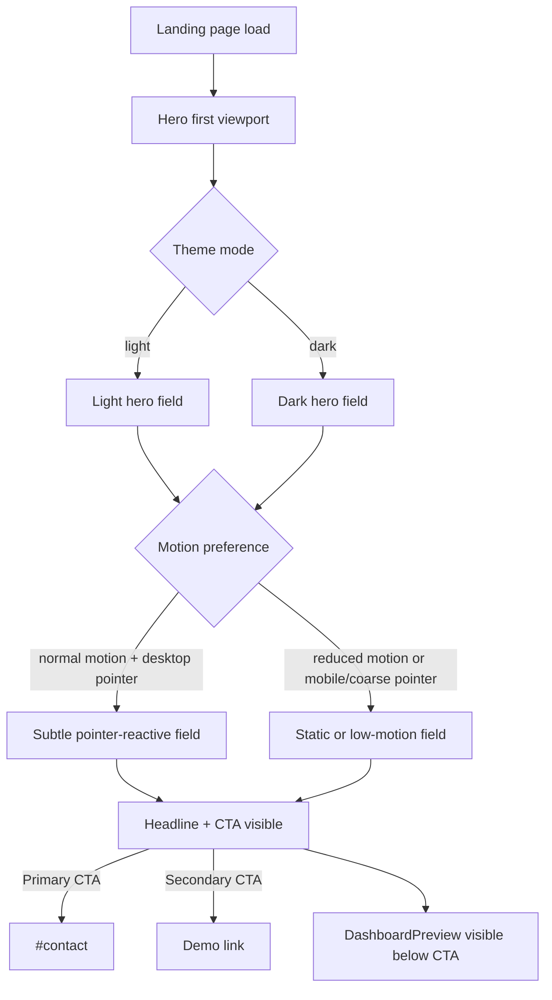
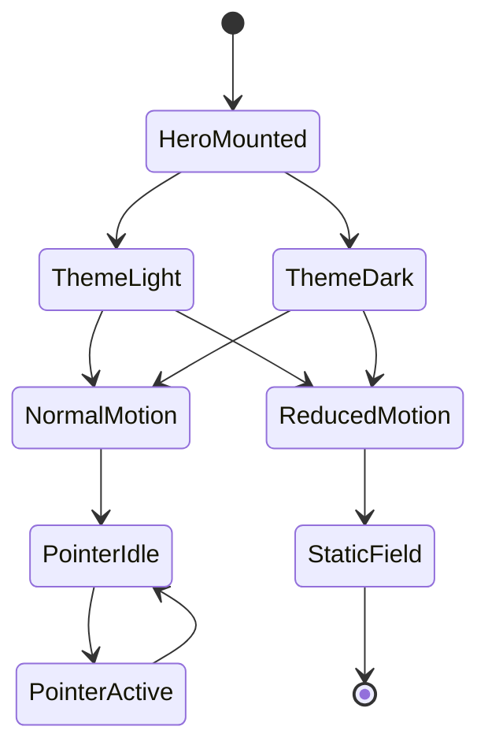

# 와이어프레임 네비게이션 — hero-01 레퍼런스 기반 Hero 섹션 재개선

> **Feature slug**: `hero-01-reference-hero-refresh`
> **화면 정의**: [screens.md](./screens.md)
> **작성일**: 2026-04-28

---

## 1. 네비게이션 범위

이 feature는 새 페이지 이동 구조를 추가하지 않는다. 다루는 범위는 landing page 내부의 Hero 상태 변화와 기존 CTA/link 흐름이다.

| 흐름 | 상태 |
|---|---|
| 페이지 로드 -> Hero 첫 viewport | 기존 흐름 유지 |
| Theme toggle -> Hero palette 갱신 | 기존 흐름 유지, Hero palette adaptation 추가 필요 |
| CTA 클릭 -> `#contact` | 기존 흐름 유지 |
| 보조 CTA 클릭 -> demo link | 기존 흐름 유지 |
| Pointer 이동 -> 약한 field 반응 | desktop 선택 사항 |
| Reduced motion -> static/low-motion Hero | 신규 상태 |

## 2. Mermaid 흐름도

위 Mermaid label은 구현자가 상태 이름을 그대로 추적할 수 있게 영어 식별자를 유지했다.

## 3. 상호작용 흐름

| 상호작용 | 트리거 | 기대 결과 | 가드레일 |
|---|---|---|---|
| 페이지 로드 | 사용자가 landing page를 연다 | `HeroFieldLayer`가 content 뒤에 렌더링된다. | layout shift가 없어야 한다. |
| Theme mode 변경 | 현재 theme provider가 `data-theme`를 바꾼다 | Hero palette가 theme에 맞게 바뀐다. | text contrast가 유지되어야 한다. |
| Pointer 이동 | desktop pointer가 Hero 안에서 움직인다 | pointer 주변에 약한 highlight가 따라온다. | reduced motion과 coarse pointer에서는 비활성화한다. |
| Primary CTA 클릭 | `도입 문의하기` 클릭 | 기존 `#contact` 이동을 수행한다. | background가 click을 가로채면 안 된다. |
| Secondary CTA 클릭 | `데모 보기` 클릭 | 기존 external/demo 동작을 수행한다. | background가 click을 가로채면 안 된다. |
| Reduced motion | OS/browser motion 설정 | static 또는 low-motion field를 보여준다. | hierarchy는 그대로 유지한다. |

## 4. 상태 흐름

상태명은 구현 대상 component/state 이름과 매칭하기 위해 영어를 유지한다.

## 5. 네비게이션에 포함하지 않는 요소

| Reference 요소 | 제외 이유 |
|---|---|
| color scheme buttons | production landing에는 palette 전환 흐름이 없다. |
| color adjuster panel | design/debug UI이며 사용자-facing 기능이 아니다. |
| export palette | landing 사용자 행동과 관련이 없다. |
| custom cursor | 전역 interaction 변경이며 이번 범위에서 제외했다. |
| footer attribution | 현재 landing 구조의 네비게이션 흐름이 아니다. |

## 6. 라우팅 결정

| 항목 | 결정 |
|---|---|
| 다음 pipeline stage | `/plan-bridge` |
| 이유 | wireframe에서 first viewport layout과 responsive state를 정의했기 때문이다. |
| 대체 경로 | 사용자가 더 높은 visual fidelity를 원하면 bridge 전에 `/plan-design` 또는 reference refresh를 검토한다. |
