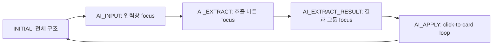
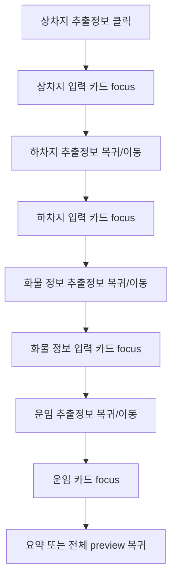
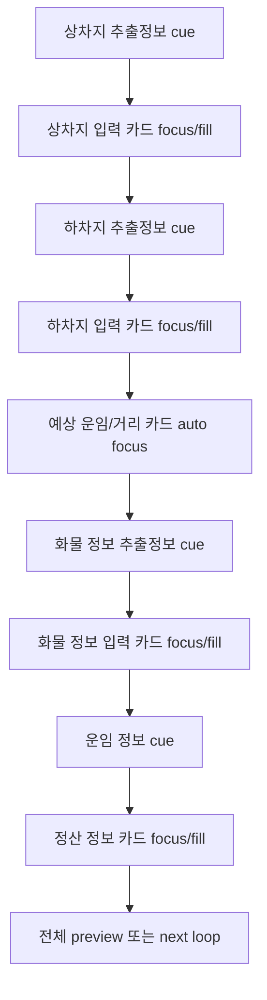

# Flow Spec: dash-preview-focus-zoom-animation

> **Feature**: Dash Preview Focus Zoom Animation
> **Requirements SSOT**: `01-requirements.md`
> **Domain Logic**: `06-domain-logic.md`
> **Created**: 2026-04-28

---

## 0. 이 문서의 역할

이 문서는 자동 재생 step과 focus sub-phase의 시간 흐름을 구현자가 바로 읽을 수 있게 정리한다.

---

## 1. Main Flow

---

## 2. AI_APPLY Sub-flow

---

### 2.1 Current Unified AI_APPLY Flow

Phase ownership:

| Phase type | Owner | Rule |
|---|---|---|
| result cue | AI panel result item | press/ripple runs only for the focused result item |
| card focus | target form card | only the focused card scales and fills |
| estimate auto phase | `form-estimate-info` | runs after delivery card, before cargo result |
| settlement phase | `form-settlement` | replaces the old fare-card target |
| column pulse | none in unified phase | disabled to avoid overlapping highlights |

## 3. Timing Policy

| 구간 | 기준 | 정책 |
|---|---|---|
| step 전환 | `PREVIEW_STEPS` duration | focus animation은 step duration 안에서 완료 |
| `AI_APPLY` sub-phase | `partialBeat`, `allBeat`, `formRevealTimeline` | 기존 timing track을 우선 재사용 |
| hover pause | `useAutoPlay.pause('hover')` | focus animation도 pause/resume 흐름과 어색하게 충돌하지 않아야 함 |
| click pause | `useAutoPlay.pause('click')` | interactive 진입 또는 step click과 충돌하지 않아야 함 |
| reduced motion | media query | duration 0 또는 highlight-only |

---

## 4. Interaction Modes

| Mode | focus viewport | overlay |
|---|---|---|
| Cinematic autoplay | 켜짐 | 꺼짐 또는 passive |
| StepIndicator manual step | 해당 step focus로 즉시 이동 | 기존 동작 유지 |
| Interactive mode | 꺼짐 우선 | 기존 hit-area 좌표 유지 |
| Reduced motion | highlight-only | 기존 접근성 유지 |
| Mobile | 없음 | 기존 `MobileCardView` |

---

## 5. Failure Handling

| 상황 | 처리 |
|---|---|
| target marker를 찾지 못함 | fallback preset 또는 전체 preview focus |
| focus transform이 crop을 만듦 | scale 하향 또는 safe area offset 조정 |
| overlay 좌표가 어긋남 | interactive mode에서 focus transform disable |
| reduced motion 감지 | pan/zoom 대신 highlight |
| mobile viewport 감지 | 즉시 `MobileCardView` path 유지 |
