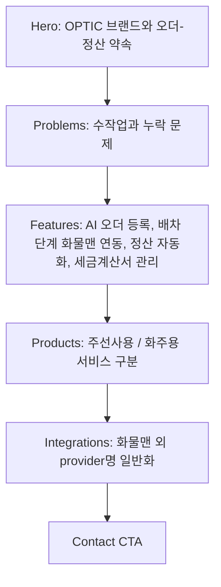
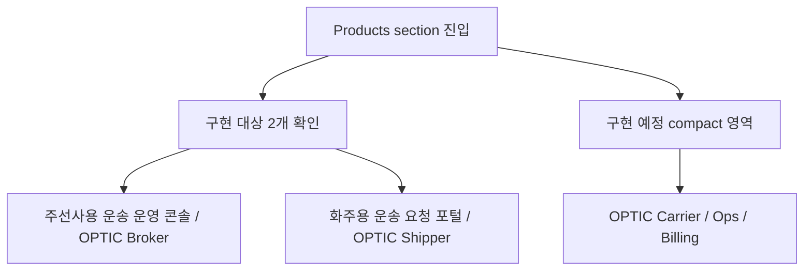

# 03. Flow - F2 카피와 제품 라인업 정리

---

## 1. Landing Scroll Flow

## 2. 주선사 업무 메시지 흐름

`화물맨 연동`은 C 단계다. 독립 제품, 정산 기능, 일반 provider 로고 나열로 처리하지 않는다.

## 3. Products Interaction Flow

## 4. F3 Handoff Flow

F2는 새 업무 매뉴얼형 섹션을 만들지 않는다. 다만 F3가 이어받을 흐름은 아래 순서로 고정한다.

1. 운영 방식 선택
2. AI 오더 등록
3. 상하차지 재사용
4. 배차 단계의 화물맨 연동
5. 정산 기준 적용
6. 세금계산서 확인
