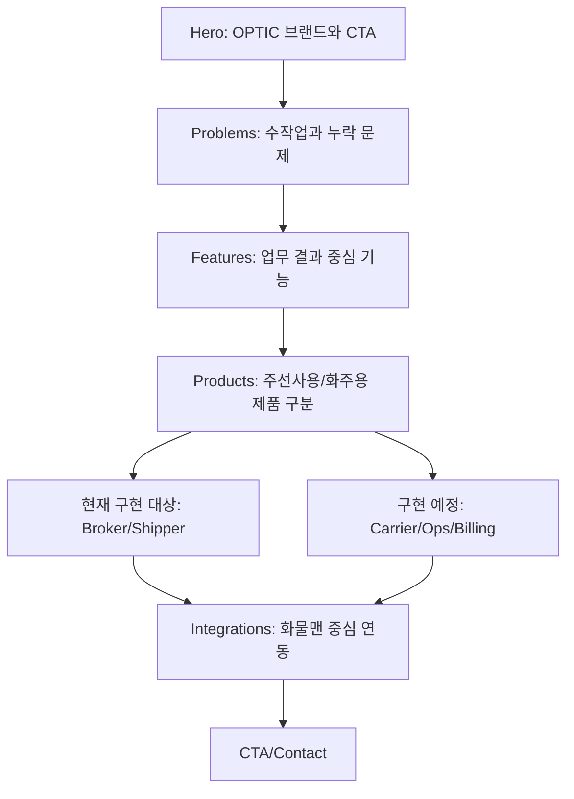
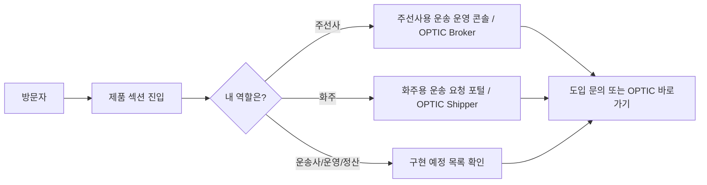

# Wireframe Navigation: f2-optic-copy-product-lineup

> F2는 신규 page route를 만들지 않는다. 기존 landing page scroll flow 안에서 products section의 정보 구조만 보강한다.

---

## 1. Page Flow

---

## 2. Interaction Flow

---

## 3. Navigation Rules

| 항목 | 규칙 |
|---|---|
| Route | 새 route 없음. 기존 landing page 내부 section anchor 유지 |
| Products tab | 기존 tab UI를 유지해도 되지만 활성 제품은 Broker/Shipper만 두고, 구현 예정은 별도 영역으로 분리 |
| Upcoming item | 활성 제품 CTA처럼 보이면 안 됨 |
| CTA | F1의 `OPTIC 바로가기`와 `도입 문의하기` 목적을 깨지 않음 |
| Keyboard | 제품 카드나 CTA가 focusable이면 focus order는 Broker → Shipper → Upcoming → CTA 순서 |

---

## 4. Scroll Anchor Impact

| Anchor | 변경 |
|---|---|
| `#features` | 유지 |
| `#products` | 유지, 내부 레이아웃만 변경 |
| `#integrations` | 유지 |
| `#contact` | 유지 |
