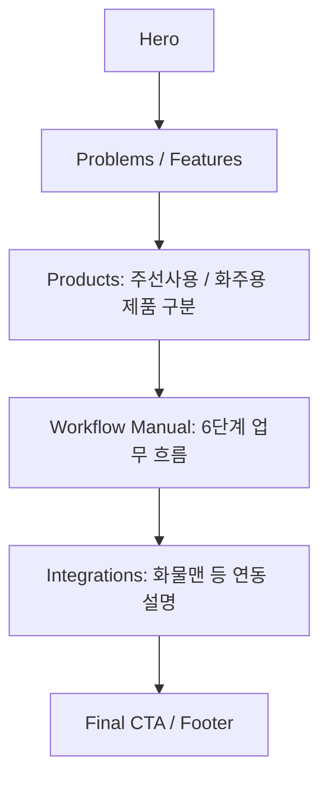
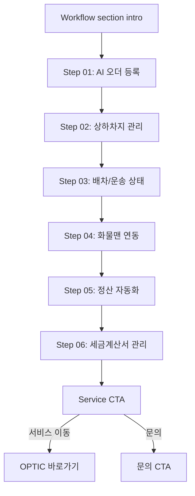

# Wireframe Navigation: f3-workflow-manual-section

> F3는 단일 신규 섹션이므로 별도 페이지 전환이 아니라 landing scroll flow 안의 위치와 CTA 이동만 정의한다.

---

## 1. Landing Flow

## 2. Section Interaction Flow

## 3. Navigation Rules

| 항목 | 기준 |
|---|---|
| 섹션 위치 | 기본 추천은 Products 직후 |
| 내부 이동 | F3 MVP에서는 step tab이나 carousel 없이 자연 scroll |
| CTA | 기존 랜딩 CTA 정책을 재사용하고, 새 URL 정책은 만들지 않음 |
| keyboard | CTA가 있을 경우 DOM 순서대로 focus 이동 |
| reduced motion | scroll animation 없이도 전체 흐름 이해 가능 |

## 4. Out-of-Scope Navigation

- 단계별 상세 페이지 이동 없음
- tab/carousel로 단계 내용을 숨기지 않음
- 실제 서비스 화면 라우팅 설계 없음
- F4 이전에는 scroll progress animation 없음
