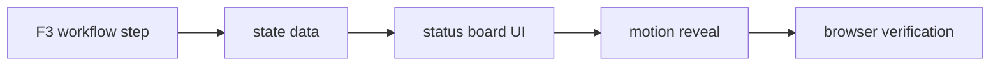

# F4 Flow

```mermaid
flowchart LR
  A["F3 workflow step"] --> B["state data"]
  B --> C["status board UI"]
  C --> D["motion reveal"]
  D --> E["browser verification"]
```

F4는 사용자가 클릭해야 하는 별도 interaction을 만들지 않는다. 스크롤 진입 시 정보가 순차적으로 드러나는 passive interaction이다.
